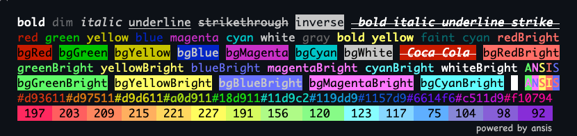
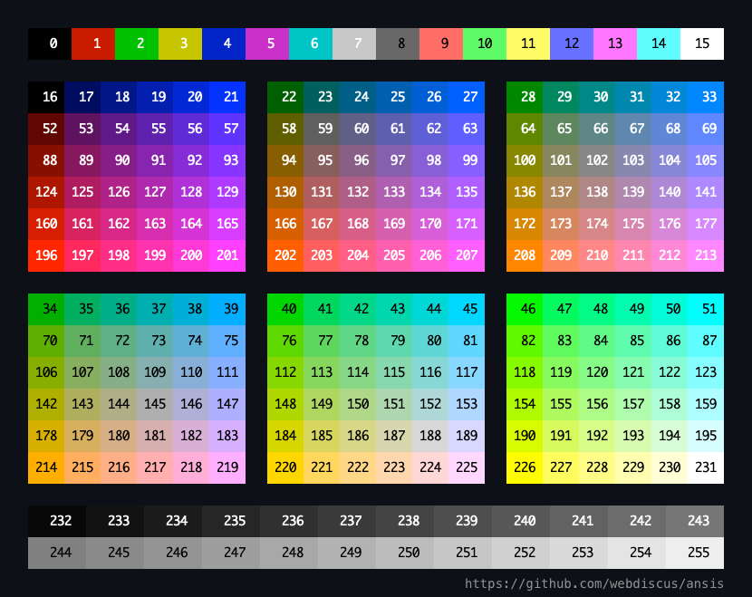

<div align="center">
  <h1>
    <a href="https://www.npmjs.com/package/ansis">
      <br>
      ANSI Styling
    </a>
  </h1>
  <div>The Node.js library for formatting text in terminal with ANSI colors & styles</div>
</div>

---
[](https://www.npmjs.com/package/ansis "download npm package")
[](https://codecov.io/gh/webdiscus/ansis)
[](https://www.npmjs.com/package/ansis)

The ansis use the SGR (Select Graphic Rendition) codes defined in
the [ECMA-48](https://www.ecma-international.org/publications-and-standards/standards/ecma-48/) standard.

> **Why yet one lib?**\
> Fastest, small, full [standard ANSI colors & styles](#base-colors), [truecolor](#truecolor), [chainable](#chained-syntax), [nestable](#nested-syntax), [template literals](#template-literals).\
> See [comparison of most popular ANSI colors libraries](https://github.com/webdiscus/ansis#compare-most-popular-ansi-libraries)
and [benchmark](https://github.com/webdiscus/ansis#benchmark).

<div align="center">
  <a href="https://www.npmjs.com/package/ansis">
    
  </a>
</div>


## Features

- supports both **ESM** and **CommonJS**
- up to **x3.5 faster** than **chalk**, [see benchmarks](#benchmark)
- dist code is **3 KB** only
- **standard API** compatible with many popular ANSI color libraries like **chalk**
- **named import** of styles & colors `import { red, blue, bold } from 'ansis/colors'`
- supports **chained** `red.bold('text')` syntax
- supports nested **template literals** ``` red`A ${cyan`B`} A` ```
- **ANSI 256** colors and Truecolor (**RGB**, **HEX**)
- supports **extending of base colors** with named custom truecolor
- auto detects color support
- supports the environment variables [`NO_COLOR`](https://no-color.org) `FORCE_COLOR` and flags `--no-color` `--color`
- supports removing ANSI color codes from string (**strip ANSI codes**)
- **TypeScript** friendly
- zero dependency


<a id="install" name="install" href="#install"></a>
## Install

```bash
npm install ansis
```


## Usage

You can import module and named colors with ESM or CommonJS syntax.

```js
// ESM
import ansis from 'ansis';
import { red, black, inverse, reset } from 'ansis/colors';

// CommonJS
const ansis = require('ansis');
const { red, black, inverse, reset } = require('ansis/colors');

console.log(ansis.green`Hello ${inverse`ANSI`} World!`);
console.log(black.bgYellow`Warning:${reset.cyan` /path/to/file.js`} ${red`not found!`}`);
```

Output:\


## Named import

You can import named colors, styles and functions.
All imported colors and styles are **chainable**.

> **Note**
>
> Imported code is not treeshakeable.
> Don't worry, full functional code is `3KB` only.

```js
import { red, hex, italic } from 'ansis/colors';

red.bold('text');
italic.underline.cyan('text');
hex('#FF75D1').bgCyan.bold('text');
```


<a id="chained-syntax" name="chained-syntax" href="#chained-syntax"></a>
## Chained syntax

All colors, styles and functions are chainable. Each color or style can be combined in any order.

```js
import ansis from 'ansis';
import { red, cyan, bold, italic, hex } from 'ansis/colors';

// with namespace
ansis.red('text');
ansis.cyan.bold('text');
ansis.hex('#FF75D1').bgCyan.bold('text');
ansis.bold.bgHex('#FF75D1').cyan('text');
ansis.italic.bold.strike.yellow.bgMagentaBright('text');

// with named import
red('text');
cyan.bold('text');
hex('#FF75D1').bgCyan.bold('text');
bold.bgHex('#FF75D1').cyan('text');
italic.bold.strike.yellow.bgMagentaBright('text');
```


<a id="nested-syntax" name="nested-syntax" href="#nested-syntax"></a>
## Nested syntax

Each color or style can be nested with one another.

```js
import { red, italic, underline } from 'ansis/colors';

red(`red ${italic(`red italic ${underline(`red italic underline`)}`)} red`);

// deep nested chained styles
green(
  `green ${yellow(
    `yellow ${magenta(
      `magenta ${cyan(
        `cyan ${red.italic.underline(`red italic underline`)} cyan`,
      )} magenta`,
    )} yellow`,
  )} green`,
);
```

Output:\


<a id="templateLiterals" name="templateLiterals" href="#templateLiterals"></a>
## Template literals

Template literals allow you to make a complex template more readable and shorter.\
None of the existing libraries (chalk, kleur, colorette, colors.js etc.) support nested template strings.\
This does it only one library - `ansis`. Use it and enjoy!

```js
// import used base styles, colors and functions
import { red, green, bold, visible, inverse, hex } from 'ansis/colors';

// define custom colors
const pink = hex('#FF75D1');
const orange = hex('#FFAB40');

// template string
red`text`;
pink`text`;
orange`text`;

// chained
red.bold`text`;
bold.yellowBright`text`;
hex('#FF75D1').bgYellow.bold`text`;

// nested
red`red ${green`green ${pink.italic`pink italic`} green`} red`;
```

Multiline nested example.
```js
let cpu = 33;
let ram = 44;
let disk = 55;

// normal colors
visible`
CPU:  ${red`${cpu}%`}
RAM:  ${green`${ram}%`}
DISK: ${hex('#FFAB40')`${disk}%`}
`;

// inversed colors
inverse`
CPU:  ${red`${cpu}%`}
RAM:  ${green`${ram}%`}
DISK: ${hex('#FFAB40')`${disk}%`}
`;
```

Output:\


<a id="base-colors" name="base-colors" href="#base-colors"></a>
## Base colors and styles

Colors and styles have standard names used by many popular libraries, such as [chalk][chalk], [colorette][colorette], [kleur][kleur], [cli-color][cli-color], [ansi-colors][ansi-colors].

| Foreground colors     | Background colors | Styles                                     |
|:----------------------|:------------------|--------------------------------------------|
| `black`               | `bgBlack`         | `dim` (alias`faint`)                       |
| `red`                 | `bgRed`           | **`bold`**                                 |
| `green`               | `bgGreen`         | _`italic`_                                 |
| `yellow`              | `bgYellow`        | <u>`underline`</u>                         |
| `blue`                | `bgBlue`          | <s>`strikethrough`</s> (alias `strike`)    |
| `magenta`             | `bgMagenta`       | `doubleUnderline` (_not widely supported_) |
| `cyan`                | `bgCyan`          | `overline` (_not widely supported_)        |
| `white`               | `bgWhite`         | `frame` (_not widely supported_)           |
| `gray` (alias `grey`) | `bgGray`          | `encircle` (_not widely supported_)        |
| `blackBright`         | `bgBlackBright`   | `inverse`                                  |
| `redBright`           | `bgRedBright`     | `visible`                                  |
| `greenBright`         | `bgGreenBright`   | `hidden`                                   |
| `yellowBright`        | `bgYellowBright`  | `reset`                                    |
| `blueBright`          | `bgBlueBright`    |                                            |
| `magentaBright`       | `bgMagentaBright` |                                            |
| `cyanBright`          | `bgCyanBright`    |                                            |
| `whiteBright`         | `bgWhiteBright`   |                                            |


## Extend base colors

Defaults, the imported `ansis` instance contains [base styles and colors](#base-colors).
To extends base colors with custom color names for truecolor use the `ansis.extend()` method.

```js
import ansis from 'ansis';

// extend base colors
ansis.extend({
  pink: '#FF75D1',
  orange: '#FFAB40',
});

// the custom colors are available under namespace `ansis`
ansis.pink('text');
ansis.orange('text');
```

Usage example with TypeScript:
```ts
import ansis, { AnsiColorsExtend } from 'ansis';

// extend base colors
ansis.extend({
  pink: '#FF75D1',
  orange: '#FFAB40',
});

const write = (style: AnsiColorsExtend<'pink' | 'orange'>, message: string) => {
  console.log(ansis[style](message));
}

write('red', 'message'); // base color OK
write('pink', 'message'); // extended color OK
write('orange', 'message'); // extended color OK
write('unknown', 'message'); // TypeScript Error
```


## ANSI 256 colors

The pre-defined set of 256 colors.

<div align="center">
  <a href="https://www.npmjs.com/package/ansis">
    
  </a>
</div>

| Code range | Description                               |
|-----------:|-------------------------------------------|
|      0 - 7 | standard colors                           |
|     8 - 15 | bright colors                             |
|   16 - 231 | 6 × 6 × 6 cube (216 colors)               |
|  232 - 255 | grayscale from black to white in 24 steps |

Foreground function: `.ansi(code)` has aliases `.ansi256(code)` and `.fg(code)`\
Background function: `.bgAnsi(code)` has aliases `.ansi256(code)` and `.bg(code)`

See [ANSI color codes](https://en.wikipedia.org/wiki/ANSI_escape_code#8-bit).

```js
// foreground color
ansis.ansi(96).bold('bold Bright Cyan');
ansis.ansi256(96).bold('bold Bright Cyan'); // `ansi256` is the alias for `ansi`
ansis.fg(96).bold('bold Bright Cyan'); // `fg` is the short alias for `ansi`

// background color
ansis.bgAnsi(105)('Bright Magenta');
ansis.bgAnsi256(105)('Bright Magenta'); // `bgAnsi256` is the alias for `bgAnsi`
ansis.bg(105)('Bright Magenta'); // `bg` is the short alias for `bgAnsi`
```

> The `ansi256()` and `bgAnsi256()` methods are implemented for compatibility with the `chalk` API.


<a id="truecolor" name="truecolor" href="#truecolor"></a>
## Truecolor

Foreground: `hex` `rgb`\
Background: `bgHex` `bgRgb`

```js
// foreground color
ansis.hex('#E0115F').bold('bold Ruby');
ansis.hex('#96C')('Amethyst');
ansis.rgb(224, 17, 95).italic.underline('italic underline Ruby');

// background color
ansis.bgHex('#E0115F')('Ruby');
ansis.bgHex('#96C')('Amethyst');
ansis.bgRgb(224, 17, 95)('Ruby');
```


## Shortcuts / Themes

Define your own themes:

```js
const theme = {
  error: ansis.red.bold,
  info: ansis.cyan.italic,
  warning: ansis.black.bgYellowBright,
  ruby: ansis.hex('#E0115F'),
};

theme.error('error');
theme.info('info');
theme.warning('warning');
theme.ruby('Ruby color');
```

## Low level usage

You can use the `open` and `close` properties for each style.

```js
const myStyle = ansis.bold.italic.black.bgHex('#ABCDEF');
console.log(`Hello ${myStyle.open}ANSI${myStyle.close} World!`);
```


## New lines

Supports correct style break at the `end of line`.

```js
ansis.bgGreen(`\nAnsis\nNew Line\nNext New Line\n`);
```


## Strip ANSI codes

The Ansis class contains one method `strip()` to remove all ANSI codes from string.

```js
import ansis from 'ansis';

const ansiString = ansis.green(`Hello ${ansis.inverse('ANSI')} World!`);
const string = ansis.strip(ansiString);
```

The variable `string` will contain the pure string `Hello ANSI World!`.


## CLI

Defaults, the output in terminal console is colored and output in a file is uncolored.

### Environment variables
_example.js_
```js
import ansis from 'ansis';

console.log(ansis.red`COLOR`);
```

```
$ node example.js           #=> color
$ node example.js > log.txt #=> no color
```

To force disable or enable colored output use environment variables `NO_COLOR` and `FORCE_COLOR`.

```
$ NO_COLOR=1 node example.js              #=> force disable colors
$ FORCE_COLOR=0 node example.js           #=> force disable colors
$ FORCE_COLOR=1 node example.js > log.txt #=> force enable colors
```

> **Note**
>
> The `NO_COLOR` variable should be presents with any not empty value.
> The value is not important, see standard description by [NO_COLOR](https://no-color.org/).\
> `NO_COLOR=1` `NO_COLOR=true` disable colors
>
> The `FORCE_COLOR` variable should be presents with one of values:\
> `FORCE_COLOR=0`  force disable colors\
> `FORCE_COLOR=1`  force enable colors


### Arguments for executable script
If you have an executable script.\
_example.js_
```js
#!/usr/bin/env node
import ansis from 'ansis';

console.log(ansis.red`COLOR`);
```

Use arguments `--no-color` or `--color=false` to disable colors and `--color` to enable ones.
```
$ ./example.js                        #=> color
$ ./example.js --no-color             #=> no color
$ ./example.js --color=false          #=> no color

$ ./example.js > log.txt              #=> no color
$ ./example.js --color > log.txt      #=> color
$ ./example.js --color=true > log.txt #=> color
```


<a id="compare" href="#compare"></a>
## Comparison of most popular libraries

|                             Library                              |                    <nobr>Naming of</nobr><br><nobr>base colors</nobr>                    | Chained<br>syntax | Nested<br>template strings | New<br>Line |            ANSI 256<br>colors<br>methods             | Truecolor<br>methods | Supports<br>CLI params                                   |
|:----------------------------------------------------------------:|:----------------------------------------------------------------------------------------:|:-----------------:|:--------------------------:|:-----------:|:----------------------------------------------------:|:--------------------:|:---------------------------------------------------------|
|         [`colors.js`][colors.js]<br>code size **18.1KB**         | _non-standard_, <nobr>e.g. `brightRed`</nobr> (16 colors)<br><nobr>❌ named import</nobr> |         ✅         |             ❌              |      ✅      |                          ❌                           |          ❌          | only<br>`FORCE_COLOR`<br>`--no-color`<br>`--color`       |
|         [`colorette`][colorette]<br>code size **3.3KB**          |              **standard**<br>(**16** colors)<br><nobr>✅ named import</nobr>              |         ❌         |             ❌              |      ❌      |                          ❌                           |          ❌          | `NO_COLOR`<br>`FORCE_COLOR`<br>`--no-color`<br>`--color` |
|        [`picocolors`][picocolors]<br>code size **2.6KB**         |                **standard**<br>(8 colors)<br><nobr>❌ named import</nobr>                 |         ❌         |             ❌              |      ❌      |                          ❌                           |          ❌          | `NO_COLOR`<br>`FORCE_COLOR`<br>`--no-color`<br>`--color` |
|                     [`cli-color`][cli-color]                     |              **standard**<br>(**16** colors)<br><nobr>❌ named import</nobr>              |         ✅         |             ❌              |      ❌      |                       `xterm(n)`                     |          ❌          | only<br>`NO_COLOR`                                       |
|         [`colors-cli`][colors-cli]<br>code size **8.6KB**          |       _non-standard_, e.g. `red_bbt`<br>(16 colors)<br><nobr>❌ named import</nobr>       |         ✅         |             ❌              |      ✅      |                        `x<n>`                        |          ❌          | only<br>`--no-color`<br>`--color`                        |
| <nobr>[`ansi-colors`][ansi-colors]</nobr><br>code size **5.8KB** |              **standard**<br>(**16** colors)<br><nobr>❌ named import</nobr>              |         ✅         |             ❌              |      ✅      |                          ❌                           |          ❌          | only<br>`FORCE_COLOR`                                    |
|             [`kleur`][kleur]<br>code size **2.7KB**              |                **standard**<br>(8 colors)<br><nobr>✅ named import</nobr>                 |         ✅         |             ❌              |      ❌      |                          ❌                           |          ❌          | only<br>`NO_COLOR`<br>`FORCE_COLOR`                      |
|              [`chalk`][chalk]<br>code size **15KB**              |              **standard**<br>(**16** colors)<br><nobr>❌ named import</nobr>              |         ✅         |             ❌              |      ✅      |            `ansi256(n)`<br>`bgAnsi256(n)`            |   `hex()` `rgb()`    | `NO_COLOR`<br>`FORCE_COLOR`<br>`--no-color`<br>`--color` |
|          [`ansis`][ansis-github]<br>code size **3.2KB**          |              **standard**<br>(**16** colors)<br><nobr>✅ named import</nobr>              |         ✅         |             ✅              |      ✅      | `ansi256(n)`<br>`bgAnsi256(n)`<br>`fg(n)`<br>`bg(n)` |   `hex()` `rgb()`    | `NO_COLOR`<br>`FORCE_COLOR`<br>`--no-color`<br>`--color` |


> **Note**
>
> **Code size**\
> The size of distributed code that will be loaded via `require` or `import` into your app. It's not a package size.
>
> **Named import**\
> `import { red, green, blue } from 'lib';`\
> or\
> `import { red, green, blue } from 'lib/colors';`
>
> **Chained syntax**\
> `lib.red.bold('text')`
>
> **Nested template strings**\
> ``` lib.red`text ${lib.cyan`nested`} text` ```
>
> **New line**\
> Correct break styles at `end-of-line`.
> ```
> lib.bgGreen(`First Line
> Next Line`);
> ```


## Show ANSI demo

```bash
git clone https://github.com/webdiscus/ansis.git
cd ./ansis
npm i
npm run demo
```

<a id="benchmark" href="#benchmark"></a>

## Benchmark

### Setup

```bash
git clone https://github.com/webdiscus/ansis.git
cd ./ansis/bench
npm i
```

### Run benchmark

```bash
npm run bench
```

> ### Tested on
>
> MacBook Pro 16" M1 Max 64GB\
> macOS Monterey 12.1\
> Node.js v16.13.1\
> Terminal `iTerm2`

### Colorette bench

The benchmark used in [`colorette`](https://github.com/jorgebucaran/colorette/blob/main/bench/index.js).

```js
c.red(`${c.bold(`${c.cyan(`${c.yellow('yellow')}cyan`)}`)}red`);
```

```diff
  colors.js           1,158,572 ops/sec
  colorette           4,572,582 ops/sec
  picocolors          3,841,124 ops/sec
  cli-color             470,320 ops/sec
  colors-cli            109,811 ops/sec
  ansi-colors         1,265,615 ops/sec
  kleur/colors        2,281,415 ops/sec
  kleur               2,228,639 ops/sec
  chalk               2,287,146 ops/sec
+ ansis               2,669,734 ops/sec
```

### Base colors

```js
const colors = ['black', 'red', 'green', 'yellow', 'blue', 'magenta', 'cyan', 'white'];
colors.forEach((color) => c[color]('foo'));
```

```diff
  colors.js             640,101 ops/sec
  colorette           1,874,506 ops/sec
  picocolors          8,265,628 ops/sec
  cli-color             305,690 ops/sec
  colors-cli            104,962 ops/sec
  ansi-colors         1,010,628 ops/sec
  kleur/colors        2,074,111 ops/sec
  kleur               5,455,121 ops/sec
  chalk               4,428,884 ops/sec
+ ansis               6,197,754 ops/sec
```

### Chained styles

```js
colors.forEach((color) => c[color].bold.underline.italic('foo'));
```

```diff
  colors.js             138,219 ops/sec
  colorette     (not supported)
  picocolors    (not supported)
  cli-color             144,837 ops/sec
  colors-cli             52,732 ops/sec
  ansi-colors           158,921 ops/sec
  kleur/colors  (not supported)
  kleur                 514,035 ops/sec
  chalk               1,234,573 ops/sec
+ ansis               5,515,868 ops/sec

```

### Nested calls

```js
colors.forEach((color) => c[color](c.bold(c.underline(c.italic('foo')))));
```

```diff
  colors.js             166,425 ops/sec
  colorette             695,350 ops/sec
  picocolors            942,592 ops/sec
  cli-color              65,561 ops/sec
  colors-cli             13,800 ops/sec
  ansi-colors           260,316 ops/sec
  kleur/colors          561,111 ops/sec
  kleur                 648,195 ops/sec
  chalk                 497,292 ops/sec
+ ansis                 558,575 ops/sec

```

### Nested styles

```js
c.red(`a red ${c.white('white')} red ${c.red('red')} red ${c.cyan('cyan')} red ${c.black('black')} red ${c.red(
  'red')} red ${c.green('green')} red ${c.red('red')} red ${c.yellow('yellow')} red ${c.blue('blue')} red ${c.red(
  'red')} red ${c.magenta('magenta')} red ${c.red('red')} red ${c.red('red')} red ${c.red('red')} red ${c.red(
  'red')} red ${c.red('red')} red ${c.red('red')} red ${c.red('red')} red ${c.red('red')} red ${c.red(
  'red')} red ${c.red('red')} red ${c.red('red')} red ${c.red('red')} red ${c.red('red')} red ${c.red(
  'red')} red ${c.red('red')} red ${c.green('green')} red ${c.red('red')} red ${c.red('red')} red ${c.red(
  'red')} red ${c.red('red')} red ${c.red('red')} red ${c.red('red')} red ${c.red('red')} red ${c.red(
  'red')} red ${c.red('red')} red ${c.red('red')} red ${c.magenta('magenta')} red ${c.red('red')} red ${c.red(
  'red')} red ${c.cyan('cyan')} red ${c.red('red')} red ${c.red('red')} red ${c.yellow('yellow')} red ${c.red(
  'red')} red ${c.red('red')} red ${c.red('red')} red ${c.red('red')} red ${c.red('red')} red ${c.red(
  'red')} red ${c.red('red')} message`);
```

```diff
  colors.js              89,633 ops/sec
  colorette             243,139 ops/sec
  picocolors            243,975 ops/sec
  cli-color              41,657 ops/sec
  colors-cli             14,264 ops/sec
  ansi-colors           121,451 ops/sec
  kleur/colors          234,132 ops/sec
  kleur                 221,446 ops/sec
  chalk                 189,960 ops/sec
+ ansis                 211,868 ops/sec

```

### Deep nested styles

```js
c.green(
  `green ${c.cyan(
    `cyan ${c.red(
      `red ${c.yellow(
        `yellow ${c.blue(
          `blue ${c.magenta(
            `magenta ${c.underline(
              `underline ${c.italic(`italic`)} underline`
            )} magenta`
          )} blue`
        )} yellow`
      )} red`
    )} cyan`
  )} green`
);
```

```diff
  colors.js             451,592 ops/sec
  colorette           1,131,757 ops/sec
  picocolors          1,002,649 ops/sec
  cli-color             213,441 ops/sec
  colors-cli             40,340 ops/sec
  ansi-colors           362,733 ops/sec
  kleur/colors          478,547 ops/sec
  kleur                 464,004 ops/sec
  chalk                 565,965 ops/sec
+ ansis                 882,220 ops/sec

```

### HEX colors

Only two libraries support truecolors methods: `ansis` and `chalk`

```js
c.hex('#FBA')('foo');
```

```diff
  colors.js             (not supported)
  colorette             (not supported)
  picocolors            (not supported)
  cli-color             (not supported)
  colors-cli            (not supported)
  ansi-colors           (not supported)
  kleur/colors          (not supported)
  kleur                 (not supported)
  chalk               2,891,684 ops/sec
+ ansis               4,944,572 ops/sec
```

## Testing

`npm run test` will run the unit and integration tests.\
`npm run test:coverage` will run the tests with coverage.

## Also See

Most popular ANSI libraries for `Node.js`:

- [colors.js][colors.js]
- [colorette][colorette]
- [picocolors][picocolors]
- [cli-color][cli-color]
- [colors-cli][colors-cli]
- [ansi-colors][ansi-colors]
- [kleur][kleur]
- [chalk][chalk]

## License

[ISC](https://github.com/webdiscus/ansis/blob/master/LICENSE)

[colors.js]: https://github.com/Marak/colors.js
[colorette]: https://github.com/jorgebucaran/colorette
[picocolors]: https://github.com/alexeyraspopov/picocolors
[cli-color]: https://github.com/medikoo/cli-color
[colors-cli]: https://github.com/jaywcjlove/colors-cli
[ansi-colors]: https://github.com/doowb/ansi-colors
[kleur]: https://github.com/lukeed/kleur
[chalk]: https://github.com/chalk/chalk
[ansis-github]: https://github.com/webdiscus/ansis
