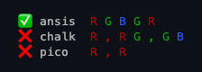

<a id="top" name="top"></a>
<div align="center">
  <a href="https://www.npmjs.com/package/ansis">
    
  </a>
  <h1 align="center">[ANSI S]tyles</h1>
</div>

[](https://www.npmjs.com/package/ansis "download npm package")
[](https://nodejs.org)
[](https://github.com/webdiscus/ansis/actions/workflows/test.yml)
[](https://codecov.io/gh/webdiscus/ansis)
[](https://www.npmjs.com/package/ansis)
[](https://packagephobia.com/result?p=ansis)

ANSI color library with support for CI, terminals, and Chromium-based browser consoles.\
Ansis is focused on [small size](#compare-size) and [speed](#benchmark) while providing rich [functionality](#compare) and handling [edge cases](#handling-input-arguments).


### 🚀 [Getting Started](#install) ⚖️ [Alternatives](#alternatives) ✨[Why Ansis](#why-ansis)  🔄 [Switch from](#switch-to-ansis)  🔧[Compatibility](#compatibility)


[](https://stackblitz.com/edit/stackblitz-starters-gs2gve?file=index.js)

<a id="features" name="features"></a>

## 💡 Highlights

- Supports **ESM**, **CommonJS**, **Bun**, **Deno**, **Next.JS**
- Works in [Chromium-based](#browsers-compatibility) browsers such as **Chrome**, **Edge**, **Opera**, **Brave**, **Vivaldi**
- Default and [named import](#import): `import ansis, { red, green, bold, dim } from 'ansis'`
- [Chained syntax](#chained-syntax): `red.bold.underline('text')`
- Nested [**tagged template strings**](#nested-syntax): ``` red`Error: ${blue`file.js`} not found!` ```
- [ANSI styles](#base-colors): `dim` **`bold`** _`italic`_ <u>`underline`</u> <s>`strikethrough`</s>
- [ANSI 16 colors](#base-colors): ``` red`Error!` ``` ``` redBright`Error!` ``` ``` bgRed`Error!` ``` ``` bgRedBright`Error!` ```
- [ANSI 256 colors](#256-colors): ``` fg(56)`violet` ``` ``` bg(208)`orange` ```
- [Truecolor](#truecolor) (**RGB & HEX**): ``` rgb(224, 17, 95)`Ruby` ``` ``` hex('#96C')`Amethyst` ```
- Automatic [fallback](#fallback): Truecolor → 256 colors → 16 colors → no colors
- [Extend base colors](#extend-colors) with named Truecolor
- Raw ANSI escape codes: ``` `foo ${red.open}red{red.close} bar` ```
- Strip ANSI escape codes with `ansis.strip()`
- Auto-detects [color support](#color-support) across a wide range of [environments](#color-support)
- Supports [ENV variables](#cli-vars) and [flags](#cli-flags): [`NO_COLOR`](using-env-no-color), [`FORCE_COLOR`](#using-env-force-color), [`COLORTERM`](#using-env-colorterm), `--no-color`, `--color`
- Reliable [CLI testing](#cli-testing) by forcing specific [color levels](#color-levels): no color, 16, 256 or truecolor
- [Replacement](#why-ansis) for [`chalk`](#replacing-chalk) [`ansi-colors`](#replacing-ansi-colors) [`colorette`](#replacing-colorette) [`picocolors`](#replacing-picocolors)

<!--  - Chromium-based browsers can display truecolor text in console.
  - Browsers that do not support ANSI codes will display black/white text in console. -->

## 🛠️ Usage

```js
import ansis, { red, cyan, fg, hex } from 'ansis';

ansis.blueBright('file.txt')
red`Error: ${cyan(file)} not found!`
red.bgWhite`ERROR`
fg(215)`ANSI 256 colors`
hex('#E0115F').bold.underline('Truecolor')
```

<!--
## 🌍 Used by

[NestJS](https://github.com/nestjs/nest), [Sequelize](https://github.com/sequelize/sequelize), [TypeORM](https://github.com/typeorm/typeorm), [Salesforce](https://github.com/salesforcecli/cli), [Oclif](https://github.com/oclif/core)
-->

<a id="alternatives" name="alternatives"></a>

## ⚖️ Alternatives

The most popular ANSI libraries, similar to Ansis:

[chalk][chalk], [picocolors][picocolors], [colorette][colorette], [kleur][kleur], [ansi-colors][ansi-colors], [kolorist][kolorist], [cli-color][cli-color], [colors-cli][colors-cli], [colors.js][colors.js], [tinyrainbow][tinyrainbow]


✅ [Compare features](#compare) 🧩 [Handling edge cases](#handling-input-arguments) 📦 [Compare package sizes](#compare-size) 📊 [Benchmarks](#benchmark)


<a id="why-ansis" name="why-ansis"></a>

## ✨ [Why use Ansis](#switch-to-ansis)

As of 2025, two of the [smallest](#compare-size) and [fastest](#benchmark) ANSI libraries are **Ansis** and **Picocolors**.
Both are [recommended](https://github.com/es-tooling/module-replacements/blob/main/docs/modules/chalk.md) by the [ES Tooling](https://github.com/es-tooling) community as modern replacements for older, larger libraries.


### 📦 Unpacked size

The package size in `node_modules` directory:

- `picocolors`: [6.37 kB][npm-picocolors] (not minimized) - A micro library with basic features.
- `аnsis`: [6.1 kB][npm-ansis] (minimized) - A powerful library containing all the features you need.
- `chalk`:  [44.2 kB][npm-chalk] (not minimized) - Provides similar functionality to Ansis.

### ⚡ Performance

- `picocolors`: The [fastest](#bench-simple) when applying a single style (e.g., `red`) only.
- `аnsis`: The [fastest](#bench-2-styles) when applying two or more styles (e.g., `red` + `bgWhite`).
- `chalk`: Slower than both **Ansis** and **Picocolors** in all use cases.

> [!CAUTION]
> **Picocolors** doesn't handle important **edge cases**, so it is the fastest and smallest.
>
> **Picocolors** is faster only in a [simple](#bench-simple) micro-benchmark, which does not reflect real world usage.\
> In a more complex benchmark, **Ansis** is much [closer](#bench-picocolors-complex) to **Picocolors** results or even [faster](#bench-3-styles).

<a id="edge-cases" name="edge-cases"></a>
### 🧩 Edge cases

#### Absent, `undefined` or `null` arguments

**Ansis** handles these cases correctly.

```js
ansis.red()          // ✅ ''
chalk.red()          // ✅ ''
pico.red()           // ❌ \e[31mundefined\e[39m

ansis.red(undefined) // ✅ ''
chalk.red(undefined) // ❌ \e[31mundefined\e[39m
pico.red(undefined)  // ❌ \e[31mundefined\e[39m

ansis.red(null)      // ✅ ''
chalk.red(null)      // ❌ \e[31mnull\e[39m
pico.red(null)       // ❌ \e[31mnull\e[39m

ansis.reset()        // ✅ \e[0m
chalk.reset()        // ❌ ''
pico.reset()         // ❌ \e[0mundefined\e[0m
```

See more details about [handling input arguments](#handling-input-arguments) in various libraries.

#### Empty string

**Ansis** and **Chalk** handle this case and return an empty string without ANSI codes as expected.\
However, **Picocolors** doesn't handle this case.

```js
ansis.red('')          // ✅ ''
chalk.red('')          // ✅ ''
pico.red('')           // ❌ \e[31m\e[39m
```

#### Break style at New Line

**Ansis** and **Chalk** add a style break at each `new line` to correctly display multi-line text.\
However, **Picocolors** doesn't handle this case.

```js
ansis.bgRed('\n ERROR \n') + ansis.cyan('The file not found!') // ✅
chalk.bgRed('\n ERROR \n') + chalk.cyan('The file not found!') // ✅
pico.bgRed('\n ERROR \n') + pico.cyan('The file not found!')   // ❌
```


#### Nested template strings

Only **Ansis** handles this very useful use case.

```js
ansis.red`R ${ansis.green`G ${ansis.blue`B`} G`} R` // ✅
chalk.red`R ${chalk.green`G ${chalk.blue`B`} G`} R` // ❌
pico.red`R ${pico.green`G ${pico.blue`B`} G`} R`    // ❌
```




### 🔧 Maintenance

As of 2025, only **Ansis**, **Chalk**, and **Picocolors** are actively maintained, unlike many other libraries:

- `colorette`: Last updated [2 years ago][npm-colorette]
- `ansi-colors`: Last updated [3 years ago][npm-ansi-colors]
- `kleur`: Last updated [3 years ago][npm-kleur]
- `colors.js`: Last updated [2 years ago][npm-colors.js]
- `cli-color`: Last updated [1 year ago][npm-cli-color]
- `colors-cli`: Last updated [1 year ago][npm-colors-cli]


<a id="checklist-lib-choice" name="checklist-lib-choice"></a>
### 🤔 Which One Should You Use?

- If you only use a single style, e.g., `red('foo')`, **Picocolors** is the best solution.

- However, if you need more, like combining multiple styles (e.g., `red` + `bold` + `bgWhite`),\
  [256 colors](#256-colors), [Truecolor](#truecolor),
  or support for a wide range of [environments](#color-support),
  then **Ansis** is the better choice.

#### Checklist:

- Does support for ESM or CJS matter?
  - ✅ Ansis: `ESM` and `CJS`
  - ☑️ Picocolors: `CJS` only
  - ☑️ Chalk: `ESM` only
- Does it matter if a library performs [~60 million](#bench-simple) or [~100 million](#bench-simple) **ops/sec** when outputting to the terminal?
  Spoiler: All libraries are more than [fast enough](#bench-picocolors-complex).
  - ✅ Picocolors
  - ☑️ Ansis
  - ☑️ Chalk
- Does it matter the unpacked size?
  - ✅ [Ansis - 6.1 kB][npm-ansis]
  - ✅ [Picocolors - 6.37 kB][npm-picocolors]
  - ❌ [Chalk - 44.2 kB][npm-chalk]
- Does support for [ANSI 256 colors](#256-colors) or [Truecolor](#truecolor) with [fallback](#fallback) matter?
  - ✅ Ansis
  - ✅ Chalk
  - ❌ Picocolors
- Does handling [edge cases](#handling-input-arguments) matter?
  - ✅ Ansis
  - ☑️ Chalk
  - ❌ Picocolors
- Does supporting a wide range of [environments](#color-support) matter?
  - ✅ Ansis
  - ✅ Chalk
  - ❌ Picocolors
- Does keeping your code clean and readable matter?
  - ✅ Ansis ([default and named import](#import), [chained syntax](#chained-syntax), [nested **template strings**](#nested-syntax))
  - ✅ Chalk (default import, chained syntax)
  - ☑️ Picocolors (default import, nested calls)


Explore the list of [features](#compare), [package sizes](#compare-size), and [benchmarks](#benchmark) compared to similar libraries.

> [!TIP]
>
> **To keep your code clean and readable:**
> - Use the chained syntax provided by libraries like `ansis` and `chalk
> - Avoid nested calls, as they are [much slower](#bench-3-styles) and less readable than the chained syntax.

#### Usage examples
```js
import ansis, { red, green, cyan } from 'ansis' // ✅✅ supports both default and named imports
import chalk from 'chalk'                       // ✅❌ doesn't support named import
import pico from 'picocolors'                   // ✅❌ doesn't support named import

ansis.red('Error')                         //      ansis ❌ slower than picocolors
chalk.red('Error')                         //      chalk ❌ slower than ansis
pico.red('Error')                          // picocolors ✅ fastest

red.bold.bgWhite`Error`                    //      ansis ✅✅✅ fastest, short, readable
chalk.red.bold.bgWhite('Error')            //      chalk ❌☑️✅ slower, short, readable
pico.red(pico.bold(pico.bgWhite('Error'))) // picocolors ❌❌❌ slowest, long, unreadable

green`Create ${blue.bold`React`} app.`                     //      ansis ✅ usability 😊
chalk.green(`Create ${chalk.blue.bold('React')} app.`)     //      chalk ☑️ usability 🙂
pico.green(`Create ${pico.blue(pico.bold('React'))} app.`) // picocolors ❌ usability 🥴
```

> [!TIP]
> Ansis supports **nested template strings**, so you can colorize text without using parentheses.

## [How to switch to Ansis](#switch-to-ansis)

- [Migrating from `chalk`](#replacing-chalk)
- [Migrating from `colorette`](#replacing-colorette)
- [Migrating from `picocolors`](#replacing-picocolors)
- [Migrating from `ansi-colors`](#replacing-ansi-colors)
- [Migrating from `kleur`](#replacing-kleur)
- [Migrating from `cli-color`](#replacing-cli-color)

---

#### [↑ top](#top)

<a id="install" name="install"></a>

## Install

```bash
npm install ansis
```

<a id="import" name="import"></a>
## Default and named import

**ESM**
```js
// Default import
import ansis from 'ansis';
// Named imports
import { red, green, bold, dim } from 'ansis';
```

**CommonJS**
```js
// Default import
const ansis = require('ansis');
// Named imports
const { red, green, bold, dim } = require('ansis');
```

<a id="template-literals" name="template-literals"></a>

## Tagged template literals

> [!TIP]
> Using [template literals](https://developer.mozilla.org/en-US/docs/Web/JavaScript/Reference/Template_literals) you can omit parentheses ``` red(`error`) ``` → ``` red`error` ``` to keep your code clean and readable.

```js
import { cyan, red } from 'ansis';

let file = '/path/to/file.txt';

red`Error: File ${cyan(file)} not found!`;
```

### Using sequences

Ansis processes tagged template literals the same way as normal strings.

```js
red('Hello\nWorld');
red`Hello\nWorld`;
```
Output (two lines in red):
```
Hello
World
```

To preserve `\n`, `\t`, `\p` and similar sequences as literal, escape them with a backslash (`\`):
```js
red('prev\\next');
red`prev\\next`;
```
Output (one line in red):
```
prev\next
```

<a id="nested-syntax" name="nested-syntax"></a>

## Nested template literals

Ansis correctly renders nested tagged template strings.

```js
import { green, red, yellow } from 'ansis';

red`Red ${yellow`Yellow ${green`Green`} Yellow`} Red`;

red`Error: ${yellow`Module ${green`ansis`} is missing!`} Installation required.`;
```

<a id="chained-syntax" name="chained-syntax"></a>

## Chained syntax

All colors, styles and functions are chainable. Each color or style can be combined in any order.

```js
import { red, bold, italic, hex } from 'ansis';

red.bold`text`;
hex('#FF75D1').bgCyan.bold`text`;
bold.bgHex('#FF75D1').cyan`text`;
italic.bold.yellow.bgMagentaBright`text`;
```

#### [↑ top](#top)

<a id="base-colors" name="base-colors"></a>

## ANSI Styles

`dim` **`bold`** _`italic`_ <u>`underline`</u> <s>`strikethrough`</s> `inverse` `visible` `hidden` `reset`


## ANSI 16 colors

| Standard Colors  | Bright Colors   | Standard Backgrounds | Bright Backgrounds |
|:-----------------|:----------------|:---------------------|:-------------------|
| `black`          | `gray`          | `bgBlack`            | `bgGray`           |
| `red`            | `redBright`     | `bgRed`              | `bgRedBright`      |
| `green`          | `greenBright`   | `bgGreen`            | `bgGreenBright`    |
| `yellow`         | `yellowBright`  | `bgYellow`           | `bgYellowBright`   |
| `blue`           | `blueBright`    | `bgBlue`             | `bgBlueBright`     |
| `magenta`        | `magentaBright` | `bgMagenta`          | `bgMagentaBright`  |
| `cyan`           | `cyanBright`    | `bgCyan`             | `bgCyanBright`     |
| `white`          | `whiteBright`   | `bgWhite`            | `bgWhiteBright`    |


<a name="gray-naming-in-libs"></a>
### Color naming in libraries: `gray` vs `grey` vs `blackBright`

The same ANSI codes `90` (_gray_) and `100` (_bgGray_) are referred to by different names and aliases in various libraries.

| Library                    | Standart<br>`gray`<br>`bgGray` | UK-spelling<br>`grey`<br>`bgGrey` | Spec-style<br>&nbsp;`blackBright`<br>`bgBlackBright` |
|:---------------------------|:------------------------------:|:---------------------------------:|:----------------------------------------------------:|
| [ansis][ansis]             |               ✅                |                 ❌                 |                          ❌                           |
| [yoctocolors][yoctocolors] |               ✅                |                 ❌                 |                          ❌                           |
| [kolorist][kolorist]       |               ✅                |                 ❌                 |                          ❌                           |
| [colors.js][colors.js]     |               ✅                |                 ✅                 |                          ❌                           |
| [picocolors][picocolors]   |               ✅                |                 ❌                 |                          ✅                           |
| [tinyrainbow][tinyrainbow] |               ✅                |                 ❌                 |                          ✅                           |
| [colorette][colorette]     |               ✅                |                 ❌                 |                          ✅                           |
| [chalk][chalk]             |               ✅                |                 ✅                 |                          ✅                           |
| [ansi-colors][ansi-colors] |               ✅                |                 ✅                 |                          ✅                           |
| [kleur][kleur] (8 colors)  |               ✅                |                 ✅                 |                          -                           |
| [cli-color][cli-color]     |               ❌                |                 ❌                 |                          ✅                           |
| [colors-cli][colors-cli]   |               ❌                |                 ❌                 |                          ✅                           |

However, keeping three separate names for the same color is too much and introduces ambiguity into the API.

### Holywar: Why `gray` only, without aliases?

ANSI codes for the gray color:

- &nbsp; `90` is officially "**bright black**" foreground (i.e., `gray`) in terminal specs.
- `100` is officially "**bright black**" background (i.e., `bgGray`) in terminal specs.

Ansis prefers the more intuitive and commonly used names: `gray` and `bgGray`.

- ✅ `gray`, `bgGray` - Standard spelling, common used, and intuitive
- ❌ `grey`, `bgGrey` - British spelling, uncommon, and a redundant alias for `gray`
- ❌ `blackBright`, `bgBlackBright` - Spec-style name for "bright black", less intuitive, rarely used, awkward for practical use

> [!NOTE]
> Supporting both `gray` and `grey` (or even worse, verbose aliases like `blackBright`) introduces unnecessary duplication.\
> Ansis v4 is focused on a clean, minimal API by intentionally **_avoiding redundant aliases_**.


<a id="256-colors" name="256-colors"></a>

## ANSI 256 colors

256 color functions:

- **Foreground:** `fg(code)` - equivalent to `chalk.ansi256(code)`
- **Background:** `bg(code)` - equivalent to `chalk.bgAnsi256(code)`

256 color codes:

<div align="center">
  <a href="https://www.npmjs.com/package/ansis">
    
  </a>
</div>

See [ANSI color codes](https://en.wikipedia.org/wiki/ANSI_escape_code#8-bit).

#### Fallback

If a terminal supports only 16 colors then ANSI 256 colors will be interpolated into base 16 colors.

<div align="center">
  <a href="https://www.npmjs.com/package/ansis">
    
  </a>
</div>

#### Usage example

```js
import { bold, fg, bg } from 'ansis';

// foreground color
fg(96)`Bright Cyan`;

// background color
bg(105)`Bright Magenta`;

// function is chainable
fg(96).bold`bold Bright Cyan`;

// function is avaliable in each style
bold.fg(96).underline`bold underline Bright Cyan`;

// you can combine the functions and styles in any order
bg(105).fg(96)`cyan text on magenta background`
```

<a id="truecolor" name="truecolor"></a>

## Truecolor

You can use the `hex` or `rgb` format.

Foreground function: `hex()` `rgb()`\
Background function: `bgHex()` `bgRgb()`

```js
import { bold, hex, rgb, bgHex, bgRgb } from 'ansis';

// foreground color
hex('#E0115F').bold`bold Ruby`;
hex('#96C')`Amethyst`;
rgb(224, 17, 95).italic`italic Ruby`;

// background color
bgHex('#E0115F')`Ruby`;
bgHex('#96C')`Amethyst`;
bgRgb(224, 17, 95)`Ruby`;

// you can combine the functions and styles in any order
bold.hex('#E0115F').bgHex('#96C')`ruby bold text on amethyst background`
```

#### [↑ top](#top)

<a id="fallback" name="fallback"></a>

## Fallback

The `ansis` supports fallback to supported color level.

```
Truecolor —> 256 colors —> 16 colors —> no colors (black & white)
```

If you use the `hex()`, `rgb()` or `ansis256()` functions in a terminal not supported Truecolor or 256 colors, then colors will be interpolated.


#### [↑ top](#top)

<a id="extend-colors" name="extend-colors"></a>

## Extend with Custom Colors

By default, the imported `ansis` instance includes a set of [base styles](#base-colors) and standard ANSI colors.
To define additional named colors using Truecolor (24-bit RGB), use the `ansis.extend()` method.

> [!TIP]
> Need help picking a color name? Try the [Name that Color](https://chir.ag/projects/name-that-color/#FF681F) website - just enter a hex code.

Example:

```js
import ansis from 'ansis';

const myTheme = {
  orange: '#FFAB40',
  pink: '#FF75D1',
};

// Create an instance with extended colors
const colors = ansis.extend(myTheme);

// Destructure extended and base colors
const { orange, pink, red } = colors;

console.log(colors.orange.bold('orange bold'));
console.log(orange.italic`orange italic`);
console.log(pink`pink color`);
```

TypeScript example:

```ts
import ansis, { AnsiColors } from 'ansis';

// Extends the built-in `AnsiColors` type with custom user defined color names.
type AnsiColorsExtend<T extends string> = AnsiColors | (T & Record<never, never>);

const myTheme = {
  orange: '#FFAB40',
  pink: '#FF75D1',
};

// Extend ansis with custom colors
const colors = ansis.extend(myTheme);

// Custom logger supporting both built-in and extended styles
const log = (style: AnsiColorsExtend<keyof typeof myTheme>, message: string) => {
  console.log(colors[style](message));
}

log('red', 'message'); // ✅ base color OK
log('orange', 'message'); // ✅ extended color OK
log('unknown', 'message'); // ❌ TypeScript Error
```

> [!WARNING]
>
> Extended colors must be used as the first item in the style chain:
>
> ```js
> colors.orange.bold('orange bold'); // ✅ works as expected
> colors.bold.orange('bold orange'); // ❌ won't work: extended color used as a subchain
> ```

---

#### [↑ top](#top)

<a id="cli-vars" name="cli-vars"></a>

## CLI environment variables

By default, output in the terminal console is colored, while output in a file is uncolored.

To force enable or disable colored output, you can use the `NO_COLOR` and `FORCE_COLOR` environment variables.

<a id="using-env-no-color" name="using-env-no-color"></a>
### NO_COLOR

Setting the `NO_COLOR` variable to any non-empty value will disable color output. For example:
```sh
NO_COLOR=1      # Disable colors
NO_COLOR=true   # Disable colors
```

Refer to the [`NO_COLOR` standard](https://no-color.org/) for more details.

<a id="using-env-force-color" name="using-env-force-color"></a>
### FORCE_COLOR

The [`FORCE_COLOR` standard](https://force-color.org/) variable is used to control the color output in the terminal.
The behavior of `FORCE_COLOR` in Ansis follows the Node.js convention, with a few adaptations:

| Value                   | Description                                                        |
|-------------------------|--------------------------------------------------------------------|
| `FORCE_COLOR=false`     | Disables colors                                                    |
| `FORCE_COLOR=0`         | Disables colors                                                    |
| `FORCE_COLOR=true`      | Auto-detects supported colors; enforces truecolor if none detected |
| `FORCE_COLOR=`_(unset)_ | Auto-detects supported colors; enforces truecolor if none detected |
| `FORCE_COLOR=1`         | Enables 16 colors                                                  |
| `FORCE_COLOR=2`         | Enables 256 colors                                                 |
| `FORCE_COLOR=3`         | Enables truecolor                                                  |


> [!IMPORTANT]
> In [Node.js](https://nodejs.org/api/cli.html#force_color1-2-3) `FORCE_COLOR` values of `1`, `true`,
> and and an empty string (`''`) are treated as enabling 16 colors.
>
> In Ansis:
> - `1` - enables exactly 16 colors
> - `true` - and an empty string trigger automatic color detection (16, 256, or truecolor).\
>    If no colors are detected, `truecolor` is enforced.

See:
- [Node.js getColorDepth](https://nodejs.org/api/tty.html#writestreamhascolorscount-env)
- [Node.js FORCE_COLOR=[1, 2, 3]](https://nodejs.org/api/cli.html#force_color1-2-3)

For example, _app.js_:

```js
import { red } from 'ansis';

console.log(red`red color`);
```

You can test the following behaviors by executing the script in the terminal:

```sh
node app.js           # Colored output in terminal
node app.js > log.txt # Output in file without ANSI codes

NO_COLOR=1 node app.js              # Force disable colors
FORCE_COLOR=0 node app.js           # Force disable colors
FORCE_COLOR=1 node app.js > log.txt # Force enable 16 colors
FORCE_COLOR=2 node app.js > log.txt # Force enable 256 colors
FORCE_COLOR=3 node app.js > log.txt # Force enable truecolor
```

<a name="using-env-colorterm"></a>

### COLORTERM

The `COLORTERM`  environment variable indicates color support in terminal emulators.
Its value depends on the terminal and its level of color support. Common values supported by Ansis are:

- `truecolor` or `24bit` - 16 million colors
- `ansi256` - 256 colors
- `ansi` - 16 colors

To force a specific color level, you can set the `COLORTERM` variable before running the Node script:

```sh
COLORTERM=ansi      node script.js  # Force enable 16 colors
COLORTERM=ansi256   node script.js  # Force enable 256 colors
COLORTERM=truecolor node script.js  # Force enable truecolor
```

---

#### [↑ top](#top)

<a name="color-levels"></a>

## Color levels

Ansis automatically detects color support, but you can manually set the color level.

| Level | Description                          |
|:-----:|:-------------------------------------|
|  `0`  | No colors (all colors disabled)      |
|  `1`  | Basic colors (16 colors)             |
|  `2`  | 256 colors                           |
|  `3`  | Truecolor (16 million colors)        |

You can create a new instance of `Ansis` with the desired color level.

Disable colors:
```ts
import { Ansis } from 'ansis';

const custom = new Ansis(0);
console.log(custom.red`foo`); // Output: plain string, no ANSI codes
```

Use only basic colors:
```ts
import { Ansis } from 'ansis';

const custom = new Ansis(1);
console.log(custom.hex('#FFAB40')`Orange`); // Output: fallback to yellowBright
```

---

#### [↑ top](#top)

<a name="cli-testing"></a>

## Testing CLI output

Ansis automatically detects the supported color level (none, 16, 256, or truecolor) based on the environment.

To ensure consistent test results across different terminals and environments,
you can explicitly set the desired color level using one of the supported environment variables:
`NO_COLOR`, `FORCE_COLOR` or `COLORTERM`.

> [!IMPORTANT]
>
> You must define the environment variable _before_ importing `ansis`.
>
> ```js
> process.env.NO_COLOR = '1'; // ❌ Doesn't work
> import { red } from 'ansis'; // <- Too late! NO_COLOR was undefined when ansis loaded
> ```
>
> Instead, create a separate file to set the environment variable and import it first:
> ```js
> import './no-color.js';       // ✅ Sets env variable early
> import { red } from 'ansis';  // NO_COLOR is defined
> ```

### Disable colors in tests

To ensure consistent test output without ANSI codes, you can disable color rendering using the `NO_COLOR` environment variable.

#### Disable via Environment Variable

Create a file: _no-color.js_:

```js
process.env.NO_COLOR = '1';
```

Import this file first in your test:
```js
import './no-color.js'; // disables colors
import { expect, test } from 'vitest';
import { red } from 'ansis';

console.log(red('foo')); // Output: plain "foo", no ANSI codes

test('output should not contain ANSI codes', () => {
  const output = red('foo');
  expect(output).toBe('foo');
});
```

#### Strip ANSI Codes with `ansis.strip()`

Alternatively, use `ansis.strip()` to remove color codes from strings in your tests:

```js
import { expect, describe, test } from 'vitest';
import ansis, { red } from 'ansis';

test('should remove ANSI codes from output', () => {
  const output = red('foo');
  expect(ansis.strip(output)).toBe('foo');
});
```

### Force truecolor

File: _enable-truecolor.js_:

```js
process.env.COLORTERM = 'truecolor';
```

Test file:
```js
import './enable-truecolor.js'; // enables truecolor
import { red, fg, hex } from 'ansis';

console.log(hex('#FFAB40')('orange')); // uses native ANSI RGB
console.log(fg(200)('pink'));          // uses ANSI 256
console.log(red('red'));               // uses ANSI 16
```

### Force 256 colors

File: _enable-256colors.js_:

```js
process.env.COLORTERM = 'ansi256';
```

Test file:
```js
import './enable-256colors.js'; // enables 256 colors
import { red, fg, hex } from 'ansis';

console.log(hex('#FFAB40')('orange')); // fallback to ANSI 256 colors
console.log(fg(200)('pink'));          // uses ANSI 256 colors
console.log(red('red'));               // uses ANSI 16 colors
```

### Force 16 colors

File: _enable-16colors.js_:

```js
process.env.COLORTERM = 'ansi';
```

Test file:
```js
import './enable-16colors.js'; // enables 16 colors
import { red, fg, hex } from 'ansis';

console.log(hex('#FFAB40')('orange')); // fallback to ANSI 16 colors (e.g., bright red)
console.log(fg(200)('pink'));          // fallback to ANSI 16 colors (e.g., bright magenta)
console.log(red('red'));               // uses ANSI 16 colors
```

#### [↑ top](#top)

<a id="cli-flags" name="cli-flags"></a>

### CLI arguments

Use cmd arguments `--no-color` to disable colors and `--color` to enable ones.

For example, an executable script _app.js_:

```js
#!/usr/bin/env node
import { red } from 'ansis';

console.log(red`text`);
```

Execute the script in a terminal:

```
./app.js                        # colored output in terminal
./app.js --no-color             # non colored output in terminal

./app.js > log.txt              # output in file without ANSI codes
./app.js --color > log.txt      # output in file with ANSI codes
```

> [!NOTE]
>
> Command-line arguments take precedence over environment variables.

---

#### [↑ top](#top)

<a id="color-support" name="color-support"></a>

## Color support

Ansis automatically detects the supported color level:

- Truecolor
- ANSI 256 colors
- ANSI 16 colors
- black & white (no colors)

Ansis has the method `isSupported()` that returns a `boolean` value whether the output supports ANSI color and styles.

```js
import ansis from 'ansis';

console.log('Color output: ', ansis.isSupported());
```

There is no standard way to detect which color level is supported.
The most common way to detect color support is to check the `TERM` and `COLORTERM` environment variables.
CI systems can be detected by checking for the existence of the `CI` and other specifically environment variables.
Combine that with the knowledge about which operating system the program is running on, and we have a decent enough way to detect colors.

| Terminal                         | ANSI 16<br>colors | ANSI 256<br>colors | True<br>Color |  env.<br>TERM   | env.<br>COLORTERM | Specifically ENV variables             |
|:---------------------------------|-------------------|:-------------------|:--------------|:---------------:|:-----------------:|:---------------------------------------|
| Azure CI                         | ✅                 | ❌                  | ❌             |      dumb       |                   | TF_BUILD<br>AGENT_NAME                 |
| GitHub CI                        | ✅                 | ✅                  | ✅             |      dumb       |                   | CI, GITHUB_ACTIONS                     |
| GitTea CI                        | ✅                 | ✅                  | ✅             |      dumb       |                   | CI, GITEA_ACTIONS                      |
| GitLab CI                        | ✅                 | ❌                  | ❌             |      dumb       |                   | CI, GITLAB_CI                          |
| Travis CI                        | ✅                 | ❌                  | ❌             |      dumb       |                   | TRAVIS                                 |
| PM2<br>not isTTY                 | ✅[^1]             | ✅[^1]              | ✅[^1]         |      dumb       |                   | PM2_HOME<br>pm_id                      |
| JetBrains TeamCity<br>>=2020.1.1 | ✅                 | ✅                  | ❌             |                 |                   | TEAMCITY_VERSION                       |
| JetBrains IDEA                   | ✅                 | ✅                  | ✅             | xterm-256color  |                   | TERMINAL_EMULATOR='JetBrains-JediTerm' |
| VS Code                          | ✅                 | ✅                  | ✅             | xterm-256color  |     truecolor     |                                        |
| Windows<br>Terminal              | ✅                 | ✅                  | ✅[^2]         |                 |                   |                                        |
| Windows<br>PowerShell            | ✅                 | ✅                  | ✅[^2]         |                 |                   |                                        |
| macOS Terminal                   | ✅                 | ✅                  | ❌             | xterm-256color  |                   |                                        |
| iTerm                            | ✅                 | ✅                  | ✅             | xterm-256color  |     truecolor     |                                        |
| Kitty                            | ✅                 | ✅                  | ✅             |   xterm-kitty   |     truecolor     |                                        |
| KDE Konsole                      | ✅                 | ✅                  | ✅             | xterm-256color  |     truecolor     |                                        |

[^1]: Colors supported depends on actual terminal.\
[^2]: The Windows terminal supports true color since Windows 10 revision 14931 (2016-09-21).

See also:

- [Truecolor Support in Output Devices](https://github.com/termstandard/colors#truecolor-support-in-output-devices).
- [So you want to render colors in your terminal](https://marvinh.dev/blog/terminal-colors/).

---

#### [↑ top](#top)

<a id="compare" name="compare"></a>

## Compare the features of most popular libraries

Run the command to see the support of some features by various libraries:

```
npm run compare
```

[](https://stackblitz.com/edit/compare-colorize-libraries?file=index.js)

<table>
  <tr>
    <th>Library</th>
    <th colspan="2">Colors support</th>
    <th colspan="4">Features</th>
  </tr>
  <tr>
    <th style='text-align:left'>
      <nobr>- <code>ESM</code> | <code>CJS</code></nobr><br>
      <nobr> - named import</nobr><br>
      <nobr>- naming colors</nobr>
    </th>
    <th><nobr>16 | 256 | 16m | 🌐</nobr></th>
    <th>Fallback</th>
    <th>Chained<br>syntax</th>
    <th>Nested<br>template<br>strings<br><code>`${}`</code><br></th>
    <th>LF<br><code>\n</code></th>
    <th>Supports<br>ENV vars<br>CLI flags</th>
  </tr>

  <tr>
    <td style='text-align:left'>
      <a href="https://github.com/webdiscus/ansis"><code>ansis</code></a><br>
      <code>ESM</code> <code>CJS</code><br>
      <nobr><code>✅ named import</code></nobr><br><code>✅ standard</code>
    </td>
    <td style='text-align:center'>✅ ✅ ✅ ✅</td>
    <td style='text-align:left'>→256<br>→16<br>→b&amp;w</td>
    <td style='text-align:center'>✅</td>
    <td style='text-align:center'>✅</td>
    <td style='text-align:center'>✅</td>
    <td style="text-align:left"><code>NO_COLOR</code><br><code>FORCE_COLOR</code><br><code>COLORTERM</code><br><code>--no-color</code><br><code>--color</code></td>
  </tr>

  <tr>
    <td style="text-align:left"><a href="https://github.com/chalk/chalk"><code>chalk v5</code></a><br><code>ESM</code><br><nobr><code>❌ named import</code></nobr><br><code>✅ standard</code></td>
    <td style="text-align:center">✅ ✅ ✅ ✅</td>
    <td>→256<br>→16<br>→b&amp;w</td>
    <td style="text-align:center">✅</td>
    <td style="text-align:center">❌</td>
    <td style="text-align:center">✅</td>
    <td style="text-align:left"><code>NO_COLOR</code><br><code>FORCE_COLOR</code><br><code>--no-color</code><br><code>--color</code></td>
  </tr>

<tr>
<td style="text-align:left"><a href="https://github.com/marvinhagemeister/kolorist"><code>kolorist</code></a><br><code>ESM</code> <code>CJS</code><br><nobr><code>✅ named import</code></nobr><br><code>❌ standard</code></td>
<td style="text-align:center">✅ ✅ ✅ ❌</td>
<td>→256<br>→b&amp;w</td>
<td style="text-align:center">❌</td>
<td style="text-align:center">❌</td>
<td style="text-align:center">❌</td>
<td style="text-align:left"><code>NO_COLOR</code><br><code>FORCE_COLOR</code></td>
</tr>

<tr>
<td style="text-align:left"><a href="https://github.com/medikoo/cli-color"><code>cli-color</code></a><br><code>CJS</code><br><nobr><code>❌ named import</code></nobr><br><code>✅ standard</code></td>
<td style="text-align:center">✅ ✅ ❌ 🛑</td>
<td>→16<br>→b&amp;w</td>
<td style="text-align:center">✅</td>
<td style="text-align:center">❌</td>
<td style="text-align:center">❌</td>
<td style="text-align:left"><code>NO_COLOR</code></td>
</tr>

<tr>
<td style="text-align:left"><a href="https://github.com/jaywcjlove/colors-cli"><code>colors-cli</code></a><br><code>CJS</code><br><nobr><code>❌ named import</code></nobr><br><code>❌ standard</code></td>
<td style="text-align:center">✅ ✅ ❌ 🛑</td>
<td>→b&amp;w</td>
<td style="text-align:center">✅</td>
<td style="text-align:center">❌</td>
<td style="text-align:center">✅</td>
<td style="text-align:left"><code>--no-color</code><br><code>--color</code></td>
</tr>

<tr>
<td style="text-align:left"><a href="https://github.com/DABH/colors.js"><code>colors.js</code></a><br><code>CJS</code><br><nobr><code>❌ named import</code></nobr><br><code>❌ standard</code></td>
<td style="text-align:center">✅ ❌ ❌ 🛑</td>
<td>→b&amp;w</td>
<td style="text-align:center">✅</td>
<td style="text-align:center">❌</td>
<td style="text-align:center">✅</td>
<td style="text-align:left"><code>FORCE_COLOR</code><br><code>--no-color</code><br><code>--color</code></td>
</tr>

<tr>
<td style="text-align:left"><a href="https://github.com/doowb/ansi-colors"><code>ansi-colors</code></a><br><code>CJS</code><br><nobr><code>❌ named import</code></nobr><br><code>✅ standard</code></td>
<td style="text-align:center">✅ ❌ ❌ ❌</td>
<td>❌</td>
<td style="text-align:center">✅</td>
<td style="text-align:center">❌</td>
<td style="text-align:center">✅</td>
<td style="text-align:left"><code>FORCE_COLOR</code></td>
</tr>

<tr>
<td style="text-align:left"><a href="https://github.com/jorgebucaran/colorette"><code>colorette</code></a><br><code>ESM</code> <code>CJS</code><br><nobr><code>✅ named import</code></nobr><br><code>✅ standard</code></td>
<td style="text-align:center">✅ ❌ ❌ 🛑</td>
<td>→b&amp;w</td>
<td style="text-align:center">❌</td>
<td style="text-align:center">❌</td>
<td style="text-align:center">❌</td>
<td style="text-align:left"><code>NO_COLOR</code><br><code>FORCE_COLOR</code><br><code>--no-color</code><br><code>--color</code></td>
</tr>

<tr>
<td style="text-align:left"><a href="https://github.com/alexeyraspopov/picocolors"><code>picocolors</code></a><br><code>CJS</code><br><nobr><code>❌ named import</code></nobr><br><code>✅ standard</code></td>
<td style="text-align:center">✅ ❌ ❌ ❌</td>
<td>→b&amp;w</td>
<td style="text-align:center">❌</td>
<td style="text-align:center">❌</td>
<td style="text-align:center">❌</td>
<td style="text-align:left"><code>NO_COLOR</code><br><code>FORCE_COLOR</code><br><code>--no-color</code><br><code>--color</code></td>
</tr>

<tr>
<td style="text-align:left"><a href="https://github.com/tinylibs/tinyrainbow"><code>tinyrainbow</code></a><br><code>ESM</code><br><nobr><code>❌ named import</code></nobr><br><code>✅ standard</code></td>
<td style="text-align:center">✅ ❌ ❌ ✅</td>
<td>→b&amp;w</td>
<td style="text-align:center">❌</td>
<td style="text-align:center">❌</td>
<td style="text-align:center">❌</td>
<td style="text-align:left"><code>NO_COLOR</code><br><code>FORCE_COLOR</code><br><code>FORCE_TTY</code><br><code>--no-color</code><br><code>--color</code></td>
</tr>

<tr>
<td style="text-align:left"><a href="https://github.com/lukeed/kleur"><code>kleur</code></a><br><code>ESM</code> <code>CJS</code><br><nobr><code>✅ named import</code></nobr><br><code>✅ standard</code></td>
<td style="text-align:center">❌ ❌ ❌ ✅<br><code>8</code> colors</td>
<td>→b&amp;w</td>
<td style="text-align:center">✅</td>
<td style="text-align:center">❌</td>
<td style="text-align:center">❌</td>
<td style="text-align:left"><code>NO_COLOR</code><br><code>FORCE_COLOR</code></td>
</tr>

</table>


### Notes

**Named import**\
ESM\
`import { red, green, blue } from 'lib';`\
CJS\
`const { red, green, blue } = require('lib');`

**Naming colors**
 - standard: colors have [standard names](#base-colors-and-styles), e.g.: `red`, `redBright`, `bgRed`, `bgRedBright`
 - _non-standard_: colors have lib-specific names, e.g.: `brightRed`, `bgBrightRed`, `red_b`, `red_btt`

#### Colors support

- `16` - [ANSI 16 colors](#base-colors) like `red`, `redBright`, `bgRed`, `bgRedBright`

- `256` - [ANSI 256 colors](#256-colors) methods, e.g.:
  - [`ansis`][ansis]: `fg(n)`, `bg(n)`
  - [`chalk`][chalk]: `ansi256(n)`, `bgAnsi256(n)`
  - [`cli-color`][cli-color]: `xterm(n)`
  - [`colors-cli`][colors-cli]: `x<n>`

- `16m` - [Truecolor](#truecolor) methods, e.g.: `hex()`, `bgHex()`, `rgb()`, `bgRgb()`

- 🌐 - Colored output in [Chromium-based](#browsers-compatibility) browser console:
  - ✅ - colored output
  - ❌ - b&w output
  - 🛑 - **fatal error** by compilation or in runtime

- [Fallback](#fallback) - Truecolor → 256 colors → 16 colors → no colors

#### Features

- **Chained syntax**\
  `lib.red.bold('text')`

- **Nested template strings**\
  ``` lib.red`text ${lib.cyan`nested`} text` ```

- `LF` - **Correct break styles** at `end-of-line` (`\n`).
  ```js
  console.log(bgGreen('\nAnsis\nNew Line\nNext New Line\n'))
  ```
  Outputs:\
  

<a id="handling-input-arguments" name="handling-input-arguments"></a>

### Edge cases: input arguments

Compare how different libraries handle various input arguments in their functions.

| Library                        | `c.reset()`  | `c.red()`      | `c.red(undefined)` | `c.red(null)` | `c.red('')` |
|--------------------------------|--------------|----------------|--------------------|---------------|-------------|
| [`ansis`][ansis]               | ✅`\e[0m`     | ✅`''`          | ✅`''`              | ✅`''`         | ✅`''`       |
| [`chalk`][chalk]               | ❌`''`        | ✅`''`          | ❌`'undefined'`     | ❌`'null'`     | ✅`''`       |
| [`picocolors`][picocolors]     | ❌`undefined` | ❌`'undefined'` | ❌`'undefined'`     | ❌`'null'`     | ❌`'ESC'`    |
| [`tinyrainbow`][tinyrainbow]   | ❌`undefined` | ❌`'undefined'` | ❌`'undefined'`     | ❌`'null'`     | ❌`'ESC'`    |
| [`colorette`][colorette]       | ❌`''`        | ✅`''`          | ✅`''`              | ❌`'null'`     | ✅`''`       |
| [`kleur`][kleur]               | ❌`[object]`  | ❌`[object]`    | ❌`[object]`        | ❌`'null'`     | ❌`'ESC'`    |
| [`ansi-colors`][ansi-colors]   | ❌`''`        | ✅`''`          | ✅`''`              | ✅`''`         | ✅`''`       |
| [`kolorist`][kolorist]         | ❌`undefined` | ❌`'undefined'` | ❌`'undefined'`     | ❌`'null'`     | ❌`'ESC'`    |
| [`colors.js`][colors.js]       | ❌`''`        | ✅`''`          | ❌`'undefined'`     | ❌`'null'`     | ✅`''`       |
| [`cli-color`][cli-color]       | ❌`-`         | ❌`'ESC'`       | ❌`'ESC'`           | ❌`'ESC'`      | ❌`'ESC'`    |
| [`colors-cli`][colors-cli]     | ❌`-`         | ❌ `Error`      | ❌`'undefined'`     | ❌`'null'`     | ❌`'ESC'`    |

#### Legend:

- ✅`''` - Returns an _empty string_ without ANSI escape codes. This is the correct and expected behavior.
- ✅`\e[0m` - Returns the reset escape code.
- ❌`'ESC'` - Returns an _empty string_ **containing** ANSI escape codes, e.g., `\e[31m\e[39m`.
- ❌`'undefined'` - Returns the styled string `undefined`.
- ❌`'null'` - Returns the styled string `null`.
- ❌`[object]` - Returns an object of the library instance.
- ❌`-` - The feature is not supported.
- ❌`Error` - Causes a fatal error.

Other arguments are correctly handled by all libraries:
```js
c.red(0)       // '0' in red
c.red(false)   // 'false' in red
c.red(true)    // 'true' in red
c.red(5/'1px') // 'NaN' in red
c.red(1/0)     // 'Infinity' in red
```

**Ansis** ensures consistent and predictable behavior for edge-case inputs, making it a reliable choice for usage.


#### [↑ top](#top)

<a id="compare-size" name="compare-size"></a>

## Compare the size of most popular packages

| Npm package                    |          Dependencies          | Is Minified         |                                            Unpacked Size |                                                           Tarball size |
| :----------------------------- |:------------------------------:|---------------------|---------------------------------------------------------:|-----------------------------------------------------------------------:|
| [`ansis`][ansis]               |         [0][npm-ansis]         | uglified & minified |                                      [6.1 kB][npm-ansis] |             [3.6 kB](https://arve0.github.io/npm-download-size/#ansis) |
| [`picocolors`][picocolors]     |      [0][npm-picocolors]       | no                  |                                 [6.3 kB][npm-picocolors] |        [2.6 kB](https://arve0.github.io/npm-download-size/#picocolors) |
| [`tinyrainbow`][tinyrainbow]   |   [0][npm-tinyrainbow]         | uglified            |                                [8.1 kB][npm-tinyrainbow] |       [3.2 kB](https://arve0.github.io/npm-download-size/#tinyrainbow) |
| [`colorette`][colorette]       |       [0][npm-colorette]       | no                  |                                 [17.0 kB][npm-colorette] |         [4.9 kB](https://arve0.github.io/npm-download-size/#colorette) |
| [`kleur`][kleur]               |         [0][npm-kleur]         | no                  |                                     [20.3 kB][npm-kleur] |             [6.0 kB](https://arve0.github.io/npm-download-size/#kleur) |
| [`ansi-colors`][ansi-colors]   |      [0][npm-ansi-colors]      | no                  |                               [26.1 kB][npm-ansi-colors] |       [8.5 kB](https://arve0.github.io/npm-download-size/#ansi-colors) |
| [`kolorist`][kolorist]         |       [0][npm-kolorist]        | no                  |                                  [51.0 kB][npm-kolorist] |          [8.7 kB](https://arve0.github.io/npm-download-size/#kolorist) |
| [`colors.js`][colors.js]       |       [0][npm-colors.js]       | no                  |                                 [41.5 kB][npm-colors.js] | [11.1 kB](https://arve0.github.io/npm-download-size/#@colors%2fcolors) |
| [`chalk`][chalk]               |         [0][npm-chalk]         | no                  |                                     [43.7 kB][npm-chalk] |            [13.4 kB](https://arve0.github.io/npm-download-size/#chalk) |
| [`cli-color`][cli-color]       |      [`5`][npm-cli-color]      | no                  | [754.0 kB](https://packagephobia.com/result?p=cli-color) |       [216.8 kB](https://arve0.github.io/npm-download-size/#cli-color) |
| [`colors-cli`][colors-cli]     |      [0][npm-colors-cli]       | no                  |                               [511.0 kB][npm-colors-cli] |      [361.7 kB](https://arve0.github.io/npm-download-size/#colors-cli) |

**Legend**

- **Dependencies:** Number of dependencies in the package.
- **Is Minified:** Indicates whether the distributed npm package is minified.
- **Unpacked Size:** The size of the npm package in the `node_modules/` directory, (incl. dependencies).
- **Tarball size:** The size of the downloaded `*.tgz` package file.\
  You can check the package size with the following command:
  ```bash
  curl -s -o package.tgz $(npm view <package-name> dist.tarball) && echo "Tarball size: $(stat -f%z package.tgz | awk '{printf "%.2f", $1/1024}') kB"
  ```
  just replace the `<package-name>` with your package name.

**See also:**

- [npmjs](https://www.npmjs.com/package) - show install size of the published package, w/o dependencies
- [packagephobia](https://packagephobia.com) - show total install size, incl. dependencies
- [npm download size](https://arve0.github.io/npm-download-size) - show download size
- [pkg-size](https://pkg-size.dev) - find the true size of an npm package
- [bundlephobia](https://bundlephobia.com) - useless, doesn't show real tarball size of the downloaded npm package

---


## Show ANSI demo

```bash
git clone https://github.com/webdiscus/ansis.git
cd ./ansis
npm i
npm run demo
```

#### [↑ top](#top)
<a id="compatibility" name="compatibility"></a>

## Compatibility Check

Check the minimum version of your tool required for compatibility with the latest Ansis.

| Tool              | Version   | Compatibility | Supports |
|-------------------|-----------|---------------|----------|
| **Node.js**       | **v14+**  | ✅ Full support | CJS, ESM |
| **TypeScript/tsc**| **v5.0+** | ✅ Full support | CJS, ESM |
| **esbuild**       | **v0.8+** | ✅ Full support | CJS, ESM |
| **swc**           | **v1.2+** | ✅ Full support | CJS, ESM, FAUX |
| **tsup**          | **v4.0+** | ✅ Full support | CJS, ESM, FAUX |
| **tsx**           | **v3.0+** | ✅ Full support | CJS, ESM |
| **Rollup**        | **v2.0+** | ✅ Full support | CJS, ESM |
| **Vite**          | **v2.5+** | ✅ Full support | ESM |
| **Turbo**         | **v1.0+** | ✅ Full support | CJS, ESM |
| **Webpack**       | **v5.0+** | ✅ Full support | CJS, ESM |

**Supports:**
- **CJS**: CommonJS module support.
- **ESM**: ECMAScript module support.
- **FAUX**: Fake or non-standard approach to module resolution (seen in **swc**).

<a id="browsers-compatibility" name="browsers-compatibility"></a>

### Browser Compatibility for ANSI Codes

| Browser           | Version       | Colors Supported   |
|-------------------|---------------|--------------------|
| **Chrome**        | **v20+**      | TrueColor (16M)    |
| **Safari**        | **v10+**      | TrueColor (16M)    |
| **Edge**          | **v12+**      | TrueColor (16M)    |
| **Opera**         | **v12+**      | TrueColor (16M)    |
| **Brave**         | **v1.0+**     | TrueColor (16M)    |
| **Vivaldi**       | **v1.0+**     | TrueColor (16M)    |

> [!WARNING]
> **Firefox** doesn't natively support ANSI codes in the developer console.

#### [↑ top](#top)
<a id="benchmark" name="benchmark"></a>

## Benchmarks

> [!CAUTION]
> The benchmark results are meaningless numbers intended purely to promote the library and increase its popularity.
> All libraries are more than fast enough.
> These results only to show the effectiveness of micro-optimizations in the code, which does not impact on real-world usage.
>
> Of course **Picocolors** will be a little bit faster in a micro-benchmark since it has less code and doesn't handles [edge cases](#.handling-input-arguments).
>
> _Taken from the [comment](https://github.com/babel/babel/pull/13783#issuecomment-927317201) by the creator of Chalk._

To measure performance is used [benchmark.js](https://github.com/bestiejs/benchmark.js).

> [!WARNING]
>
> Results of [vitest benchmark](https://vitest.dev/config/#benchmark) are incorrect.
>
> The `vitest benchmark` generate **unreal** results.\
> For example, the results of the simple bench:
> ```
> chalk.red('foo') -  7.000.000 ops/sec
> ansis.red('foo') - 23.000.000 ops/sec (x3 faster is incorrect result)
> ```
>
> The actual performance results of Chalk and Ansis in this test are very similar.

### Run benchmarks

```bash
git clone https://github.com/webdiscus/ansis.git
cd ./ansis
npm i
npm run build
npm run bench
```

> ### Tested on
>
> MacBook Pro 16" M1 Max 64GB\
> macOS Sequoia 15.1\
> Node.js v22.11.0\
> Terminal `iTerm2` v3.5.0

---

> [!IMPORTANT]
>
> Each library uses the recommended **fastest** styling method to compare the **absolute performance**.
>
> In real practice, no one would use the **slowest** method (such as nested calls) to style a string when the library provides a **faster** and a **shorter** chained method.
>
> For example:
>
> ```js
> lib.red.bold.bgWhite(' ERROR ')           // ✅ faster, shorter, readable
> lib.red(lib.bold(lib.bgWhite(' ERROR '))) // ❌ slower, longer, unreadable
> ```

<a id="bench-simple" name="bench-simple"></a>
### Simple bench

The simple test uses only single style.
Picocolors, Colorette and Kleur do not support [chained syntax](#chained-syntax) or [correct style break](#new-line) (wenn used ``` `\n` ``` in a string),
so they are the fastest in this simple use case. _No function, no performance overhead_.

```js
ansis.red('foo')
chalk.red('foo')
picocolors.red('foo')
...
```

```diff
+  picocolors@1.1.1    109.212.939 ops/sec
   colorette@2.0.20    108.044.800 ops/sec
   kleur@4.1.5          87.800.739 ops/sec
-> ansis@3.5.0          60.606.043 ops/sec  -44.5%
-  chalk@5.3.0          55.702.479 ops/sec  -48.9%
   kolorist@1.8.0       37.069.069 ops/sec
   ansi-colors@4.1.3    14.364.378 ops/sec
   colors@1.4.0          7.060.583 ops/sec
   cli-color@2.0.4       2.753.751 ops/sec
   colors-cli@1.0.33       897.746 ops/sec
```

<a id="bench-2-styles" name="bench-2-styles"></a>
### Using 2 styles

Using only 2 styles, picocolors is already a bit slower, because using the [chained syntax](#chained-syntax) is faster than nested calls.

```js
ansis.red.bold('foo')
chalk.red.bold('foo')
picocolors.red(picocolors.bold('foo')) // chained syntax is not supported
...
```

```diff
+  ansis@3.5.0          60.468.181 ops/sec
-  picocolors@1.1.1     58.777.183 ops/sec    -2.8%
-  chalk@5.3.0          47.789.020 ops/sec   -21.5%
   colorette@2.0.20     33.387.988 ops/sec
   kolorist@1.8.0       13.420.047 ops/sec
   kleur@4.1.5           5.972.681 ops/sec
   ansi-colors@4.1.3     4.086.412 ops/sec
   colors@1.4.0          3.018.244 ops/sec
   cli-color@2.0.4       1.817.039 ops/sec
   colors-cli@1.0.33       695.601 ops/sec
```

<a id="bench-3-styles" name="bench-3-styles"></a>
### Using 3 styles

Using 3 styles, picocolors is 2x slower than ansis.

```js
ansis.red.bold.bgWhite('foo')
chalk.red.bold.bgWhite('foo')
picocolors.red(picocolors.bold(picocolors.bgWhite('foo'))) // chained syntax is not supported
...
```

```diff
+  ansis@3.5.0          59.463.640 ops/sec
-  chalk@5.3.0          42.166.783 ops/sec  -29.0%
-  picocolors@1.1.1     32.434.017 ops/sec  -45.5% (~2x slower than Ansis)
   colorette@2.0.20     13.008.117 ops/sec
   kolorist@1.8.0        5.608.244 ops/sec
   kleur@4.1.5           5.268.630 ops/sec
   ansi-colors@4.1.3     2.145.517 ops/sec
   colors@1.4.0          1.686.728 ops/sec
   cli-color@2.0.4       1.453.611 ops/sec
   colors-cli@1.0.33       590.467 ops/sec
```

<a id="bench-4-styles" name="bench-4-styles"></a>
### Using 4 styles

In rare cases, when using 4 styles, picocolors becomes 3.4x slower than ansis.

```js
ansis.red.bold.underline.bgWhite('foo')
chalk.red.bold.underline.bgWhite('foo')
picocolors.red(picocolors.bold(picocolors.underline(picocolors.bgWhite('foo')))) // chained syntax is not supported
...
```

```diff
+  ansis@3.5.0          59.104.535 ops/sec
-  chalk@5.3.0          36.147.547 ops/sec  -38.8%
-  picocolors@1.1.1     17.581.709 ops/sec  -70.2% (~3x slower than Ansis)
   colorette@2.0.20      7.981.171 ops/sec
   kleur@4.1.5           4.825.665 ops/sec
   kolorist@1.8.0        3.729.880 ops/sec
   ansi-colors@4.1.3     1.514.053 ops/sec
   colors@1.4.0          1.229.999 ops/sec
   cli-color@2.0.4       1.210.931 ops/sec
   colors-cli@1.0.33       481.073 ops/sec
```

### Deeply nested styles

The complex test with deeply nested single styles.

```js
c.green(
  `green ${c.cyan(
    `cyan ${c.red(
      `red ${c.yellow(
        `yellow ${c.blue(
          `blue ${c.magenta(`magenta ${c.underline(`underline ${c.italic(`italic`)} underline`)} magenta`)} blue`,
        )} yellow`,
      )} red`,
    )} cyan`,
  )} green`,
)
```

```diff
+  colorette@2.0.20      1.110.056 ops/sec
-  picocolors@1.1.1      1.073.299 ops/sec
-> ansis@3.5.0             847.246 ops/sec  -23.7%
   kolorist@1.8.0          847.110 ops/sec
-  chalk@5.3.0             573.942 ops/sec  -48.3%
   kleur@4.1.5             471.285 ops/sec
   colors@1.4.0            439.588 ops/sec
   ansi-colors@4.1.3       382.862 ops/sec
   cli-color@2.0.4         213.351 ops/sec
   colors-cli@1.0.33        41.097 ops/sec
```

### Colorette bench

The benchmark used in [`colorette`](https://github.com/jorgebucaran/colorette/blob/main/bench/index.js) for single styles.

```js
c.red(`${c.bold(`${c.cyan(`${c.yellow('yellow')}cyan`)}`)}red`)
```

```diff
+  picocolors@1.1.1      3.861.384 ops/sec
   colorette@2.0.20      3.815.039 ops/sec
-> ansis@3.5.0           2.918.269 ops/sec  -24.4%
   kolorist@1.8.0        2.548.564 ops/sec
-  chalk@5.3.0           2.502.850 ops/sec  -35.2%
   kleur@4.1.5           2.229.023 ops/sec
   ansi-colors@4.1.3     1.426.279 ops/sec
   colors@1.4.0          1.123.139 ops/sec
   cli-color@2.0.4         481.708 ops/sec
   colors-cli@1.0.33       114.570 ops/sec
```
<a id="bench-picocolors-complex" name="bench-picocolors-complex"></a>

### Picocolors complex bench

The [`picocolors`](https://github.com/alexeyraspopov/picocolors/blob/main/benchmarks/complex.mjs) benchmark, slightly modified.
Added a bit more complexity by applying two styles to the colored word instead of one.

```js
let index = 1e8;
c.red('.') +
c.yellow('.') +
c.green('.') +
c.red.bold(' ERROR ') +
c.red('Add plugin ' + c.cyan.underline('name') + ' to use time limit with ' + c.cyan(++index));
```

```diff
+  picocolors@1.1.1      2.601.559 ops/sec
-> ansis@3.5.0           2.501.227 ops/sec   -3.8%
   colorette@2.0.20      2.326.491 ops/sec
-  chalk@5.3.0           2.129.106 ops/sec  -18.1%
   kleur@4.1.5           1.780.496 ops/sec
   kolorist@1.8.0        1.685.703 ops/sec
   ansi-colors@4.1.3       838.542 ops/sec
   colors@1.4.0            533.362 ops/sec
   cli-color@2.0.4         287.558 ops/sec
   colors-cli@1.0.33        97.463 ops/sec
```

> [!NOTE]
>
> In this test, which is closer to practical use, each library uses the **fastest** styling method available.
>
> So, `chalk`, `ansis`, `ansi-colors`, `cli-color`, `colors-cli` and `colors` uses chained method, e.g. `c.red.bold(' ERROR ')`.
> While `picocolors`, `colorette` and `kolorist` uses nested calls, e.g. `c.red(c.bold(' ERROR '))`, because doesn't support the chained syntax.


---

#### [↑ top](#top)

<a id="switch-to-ansis" name="switch-to-ansis"></a>

## How to switch to Ansis

Ansis is a powerful, small, and fast replacement for many similar libraries.\
Just replace your `import ... from ...` or `require(...)` to `ansis`.

<a id="replacing-chalk" name="replacing-chalk"></a>

### Migrating from [chalk]

```diff
- import chalk from 'chalk';
+ import chalk from 'ansis';
```

Ansis supports the Chalk syntax and is compatible* with [styles and color names](https://github.com/chalk/chalk?tab=readme-ov-file#styles), so you don't need to modify the
original code:

```js
chalk.red.bold('Error!');

// colorize "Error: file not found!"
chalk.red(`Error: ${chalk.cyan.bold('file')} not found!`);

// truecolor
chalk.hex('#FFA500').bold('Bold orange color');
chalk.rgb(123, 45, 67).underline('Underlined reddish color');
chalk.bgHex('#E0115F')('Ruby');
chalk.bgHex('#96C')('Amethyst');
```

> [!WARNING]
>
> If used ANSI 256 colors functions, replace them with Ansis equivalents:
> ```diff
> - chalk.ansi256(196)('Error');
> + ansis.fg((196)('Error');
>
> - chalk.bgAnsi256(21)('Info');
> + ansis.bg(21)('Info');
> ```

> [!WARNING]
>
> Ansis doesn't not support the `overline` style, because it's **not widely supported** and no one uses it.\
> Check you code and remove the `overline` style:
>
> ```diff
> - chalk.red.overline('text');
> + chalk.red('text');
> ```

Optionally, you can rewrite the same code to make it even shorter and cleaner:

```js
import { red, cyan, fg, bg, hex, rgb, bgHex, bgRgb } from 'ansis';

red.bold('Error!'); // using parentheses
red.bold`Error!`;   // using template string

// colorize "Error: file not found!"
red`Error: ${cyan.bold`file`} not found!`;

// ANSI 256 colors
fg(93)`Violet color`; // equivalent for chalk.ansi256()
bg(194)`Honeydew, more or less`;  // equivalent for chalk.bgAnsi256()

// truecolor
hex('#FFA500').bold`Bold orange color`;
rgb(123, 45, 67).underline`Underlined reddish color`;
bgHex('#E0115F')`Ruby`;
bgHex('#96C')`Amethyst`;
```

#### [↑ top](#top)

<a id="replacing-colorette" name="replacing-colorette"></a>

### Migrating from [colorette]

```diff
- import { red, bold, underline } from 'colorette';
+ import { red, bold, underline } from 'ansis';
```

Ansis is fully compatible with `colorette` [styles and color names](https://github.com/jorgebucaran/colorette#supported-colors), so you don't need to modify the
original code:

```js
red.bold('Error!');
bold(`I'm ${red(`da ba ${underline("dee")} da ba`)} daa`);
```

Optionally, you can rewrite the same code to make it even shorter and cleaner:

```js
red.bold`Error!`;
bold`I'm ${red`da ba ${underline`dee`} da ba`} daa`;
```

#### [↑ top](#top)

<a id="replacing-picocolors" name="replacing-picocolors"></a>

### Migrating from [picocolors]

```diff
- import pico from 'picocolors';
+ import pico from 'ansis';
```

Ansis is fully compatible with `picocolors` [styles and color names](https://github.com/alexeyraspopov/picocolors#usage), so you don't need to modify the
original code:

```js
pico.red(pico.bold('text'));
pico.red(pico.bold(variable));

// colorize "Error: file not found!"
pico.red('Error: ' + pico.cyan(pico.bold('file')) + ' not found!');
```

Optionally, you can rewrite the same code to make it even shorter and cleaner:

```js
import { red, cyan } from 'ansis';

red.bold`text`;
red.bold(variable);

// colorize "Error: file not found!"
red`Error: ${cyan.bold`file`} not found!`
```

#### [↑ top](#top)

<a id="replacing-ansi-colors" name="replacing-ansi-colors"></a>

### Migrating from [ansi-colors]

```diff
- const c = require('ansi-colors');
+ const c = require('ansis');
```

Ansis is fully compatible with `ansi-color` [styles and color names](https://github.com/doowb/ansi-colors#available-styles), so you don't need to modify the
original code:

```js
c.red.bold('Error!');

// colorize "Error: file not found!"
c.red(`Error: ${c.cyan.bold('file')} not found!`);
```

Optionally, you can rewrite the same code to make it even shorter and cleaner:

```js
import { red, cyan } from 'ansis';

red.bold('Error!'); // using parentheses
red.bold`Error!`;   // using template string

// colorize "Error: file not found!"
red`Error: ${cyan.bold`file`} not found!`;
```

#### [↑ top](#top)

<a id="replacing-kleur" name="replacing-kleur"></a>

### Migrating from [kleur]

```diff
- import { red, green, yellow, cyan } from 'kleur';
+ import { red, green, yellow, cyan } from 'ansis';
```

Ansis is fully compatible with `kleur` [styles and color names](https://github.com/lukeed/kleur#api),
but Kleur `v3.0` no longer uses Chalk-style syntax (magical getter):

```js
green().bold().underline('this is a bold green underlined message');
yellow(`foo ${red().bold('red')} bar ${cyan('cyan')} baz`);
```

If you uses chained methods then it requires a simple code modification.
Just replace `().` with `.`:

```js
green.bold.underline('this is a bold green underlined message');
yellow(`foo ${red.bold('red')} bar ${cyan('cyan')} baz`);
```

Optionally, you can rewrite the same code to make it even shorter and cleaner:

```js
yellow`foo ${red.bold`red`} bar ${cyan`cyan`} baz`;
```

#### [↑ top](#top)

<a id="replacing-cli-color" name="replacing-cli-color"></a>

### Migrating from [cli-color]

```diff
- const clc = require('cli-color');
+ const clc = require('ansis');
```

Ansis is compatible* with `cli-color` [styles and color names](https://github.com/medikoo/cli-color#colors):

```js
clc.red.bold('Error!');

// colorize "Error: file not found!"
clc.red(`Error: ${c.cyan.bold('file')} not found!`);
```

> [!WARNING]
>
> Ansis doesn't not support the `blink` style, because it's **not widely supported** and no one uses it.\
> Check you code and remove the `blink` style:
>
> ```diff
> - clc.red.blink('text');
> + clc.red('text');
> ```

If you use ANSI 256 color functions, replace `xterm` with `fg` and `bgXterm` replace `bg`:

```diff
- clc.xterm(202).bgXterm(236)('Orange text on dark gray background');
+ clc.fg(202).bg(236)('Orange text on dark gray background');
```

Optionally, you can rewrite the same code to make it even shorter and cleaner:

```js
import { red, cyan, fg, bg } from 'ansis';

red.bold`Error!`;

// colorize "Error: file not found!"
red`Error: ${cyan.bold`file`} not found!`;

fg(202).bg(236)`Orange text on dark gray background`;
```

---

#### [↑ top](#top)

## Testing

`npm run test` will run the unit and integration tests.\
`npm run test:coverage` will run the tests with coverage.

---

#### [↑ top](#top)

## License

[ISC](https://github.com/webdiscus/ansis/blob/master/LICENSE)

[colors.js]: https://github.com/DABH/colors.js

[colorette]: https://github.com/jorgebucaran/colorette

[picocolors]: https://github.com/alexeyraspopov/picocolors

[cli-color]: https://github.com/medikoo/cli-color

[colors-cli]: https://github.com/jaywcjlove/colors-cli

[ansi-colors]: https://github.com/doowb/ansi-colors

[kleur]: https://github.com/lukeed/kleur

[kolorist]: https://github.com/marvinhagemeister/kolorist

[chalk]: https://github.com/chalk/chalk

[yoctocolors]: https://github.com/sindresorhus/yoctocolors

[ansis]: https://github.com/webdiscus/ansis

[tinyrainbow]: https://github.com/tinylibs/tinyrainbow

[npm-colors.js]: https://www.npmjs.com/package/@colors/colors

[npm-colorette]: https://www.npmjs.com/package/colorette

[npm-picocolors]: https://www.npmjs.com/package/picocolors

[npm-cli-color]: https://www.npmjs.com/package/cli-color

[npm-colors-cli]: https://www.npmjs.com/package/colors-cli

[npm-ansi-colors]: https://www.npmjs.com/package/ansi-colors

[npm-kleur]: https://www.npmjs.com/package/kleur

[npm-kolorist]: https://www.npmjs.com/package/kolorist

[npm-chalk]: https://www.npmjs.com/package/chalk

[npm-ansis]: https://www.npmjs.com/package/ansis

[npm-tinyrainbow]: https://www.npmjs.com/package/tinyrainbow