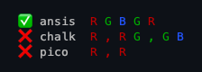

<a name="top"></a>
<div align="center">
  <a href="https://www.npmjs.com/package/ansis">
    
  </a>
  <br>
  <i>Make terminals a little more colorful 🌈</i>
  <h1 align="center">[ANSI S]tyles</h1>
</div>

[](https://www.npmjs.com/package/ansis "download npm package")
[](https://nodejs.org)
[](https://github.com/webdiscus/ansis/actions/workflows/test.yml)
[](https://codecov.io/gh/webdiscus/ansis)
[](https://www.npmjs.com/package/ansis)
[](https://packagephobia.com/result?p=ansis)


ANSI color library for use in terminals, CI environments, and Chromium-based browsers.\
Ansis is focused on small size and [speed](#benchmark) while providing rich [functionality](./docs/compare.md) and handling [edge cases](#handling-input-arguments).

```js
// Named imports - for cleaner, more readable code
import { red, cyan, bold, hex, rgb } from 'ansis';

// Clean chained syntax with template literals - no extra parentheses
console.log(bold.bgRed` FAIL `);

// Nested templates - no string concatenation needed
console.log(red`✖ Error: ${cyan`file.js`} not found`);

// Truecolor: hex and rgb
console.log(hex('#FF75D1').bold`Pink`);
console.log(rgb(224, 17, 95).italic`Ruby`);
```

## 🔗 Shortcuts

#### 🚀 [Getting Started](#getting-started) 📌 [Ansis vs `styleText()`](#ansis-vs-styleText) 🔄 [Migrating from](./docs/migrating.md) ⚖️ [Alternatives](#alternatives)

#### ⚙️ [Compatibility](#compatibility) 🔧[Troubleshooting](./docs/troubleshooting.md) 🧪 [CLI Testing](./docs/testing.md)

#### 🔔 [Upgrading to v4](https://github.com/webdiscus/ansis/discussions/36#migrating-to-v4) · [New features](https://github.com/webdiscus/ansis/discussions/36#v4-features) · [Breaking changes](https://github.com/webdiscus/ansis/discussions/36)

#### ⭐️ [Star History](#star-history)

## ✨ Highlights

```
🎨 Colors - 16 · 256 · Truecolor (hex/rgb) · Named colors (orange, pink ...)
✍️ Syntax - Chained · Template literals · Nested templates
⚙️ Works  - ESM · CJS · TS · Node 10+ · Bun · Deno · CI · Chromium browsers
🧠 Smart  - Auto color detection · Fallback (truecolor → 256 → 16 → b&w) · NO_COLOR · FORCE_COLOR
📦 Tiny   - 5.8 kB · Drop-in replacement for Chalk (44 kB)
```

## ⚡ Performance

Ansis is the fastest when using 2 or more styles, which is the common real-world use case.

| Library          |          1 style |       2+ styles |
|------------------|-----------------:|----------------:|
| `ansis`          |      60M ops/sec |  🏆 60M ops/sec |
| `picocolors`     |  🏆 109M ops/sec |     58M ops/sec |
| `chalk`          |      55M ops/sec |     47M ops/sec |
| `util.styleText` |     0.5M ops/sec |    0.5M ops/sec |


[📊 Full benchmarks →](./docs/benchmarks.md)

<a name="features"></a>
## 💡 Features

**🎨 Colors & Styles**
- [ANSI styles](#styles): `dim` **`bold`** _`italic`_ <u>`underline`</u> <s>`strikethrough`</s> ...
- [ANSI 16 colors](#base-colors): `red` `redBright` `bgRed` `bgRedBright` ...
- [ANSI 256 colors](#256-colors): `fg(n)` `bg(n)`
- [Truecolor](#truecolor): `hex('#FF75D1')` `rgb(224, 17, 95)` `bgHex()` `bgRgb()`
- [Named truecolors](#extend-colors): `orange()` `bgPink()` ... - via `extend()`

**✍️ Syntax**
- [Chained styles](#chained-syntax): `red.bold.underline` - no nested calls like `red(bold(underline()))`
- [Template literals](#template-literals): `` red`text` `` - no parentheses
- [Nested templates](#nested-templates): `` red`Error: ${cyan`file.js`} not found` `` - no string concatenations

**🛠️ Utilities**
- [Strip ANSI codes](#strip): `ansis.strip(red('text'))` → plain `'text'`
- [Hyperlinks](#hyperlink): `blue.link('Click here', 'https://...')`, `link('https://...')`
- Raw escape codes: `open` / `close` - `` `${red.open}Error${red.close} file not found` ``

**💻 Environment**
- [Auto color detection](#color-support) + [Fallback](#fallback): Truecolor → 256 → 16 → b&w
- [ENV variables](#cli-vars): `NO_COLOR` `FORCE_COLOR` `COLORTERM`
- [CLI flags](#cli-flags): `--no-color` `--color`
- [CLI testing](./docs/testing.md): force [color levels](#color-levels) in tests


**⚙️ Compatibility**
- ESM · CJS · TypeScript · Bun · Deno · Next.js · CI (GitHub and others)
- [Chromium browsers](#browsers-compatibility): Chrome · Edge · Opera · Brave · Vivaldi
- [Drop-in replacement](./docs/migrating.md) for `chalk` `ansi-colors` `colorette` [and others](#alternatives)

<h1></h1>

> 🎯 **You might also like**
> - [`flaget`](https://github.com/webdiscus/flaget) - CLI argument parsing. A smaller (5 kB) and faster alternative to [`yargs-parser`](https://www.npmjs.com/package/yargs-parser) (85 kB)
> - [`HTML bundler`](https://github.com/webdiscus/html-bundler-webpack-plugin) - Plugin for Webpack to generate static sites from templates (html, ejs, hbs, pug, ...)


<a name="alternatives"></a>
## ⚖️ Alternatives

[chalk][chalk], [picocolors][picocolors], [colorette][colorette], [kleur][kleur], [ansi-colors][ansi-colors], [kolorist][kolorist], [cli-color][cli-color], [colors-cli][colors-cli], [colors.js][colors.js], [tinyrainbow][tinyrainbow]

Since Node.js 22 supports ANSI styling natively via `util.styleText()`, it is recommended for simple use cases where 16 colors are enough and top performance is not critical.
See [`styleText()` limitations](#ansis-vs-styleText).

✅ [Compare features](./docs/compare.md) 📊 [Benchmarks](./docs/benchmarks.md) 🧩 [Handling edge cases](#edge-cases)

## Install

```
npm install ansis
```

> For Node.js 10–12+ use special build `npm install ansis@node10`

<a name="getting-started"></a>
## Usage

**ESM**
```js
import ansis, { red, bold, fg, hex, rgb } from 'ansis';
```

**CJS**
```js
const ansis = require('ansis');
const { red, bold, fg, hex, rgb } = require('ansis');
```

<a name="chained-syntax"></a>

### Chained syntax

All colors, styles and functions are chainable. Each color or style can be combined in any order.

```js
import { red, bold, hex } from 'ansis';

red.bold`text`;
hex('#FF75D1').bgCyan.bold`text`;
bold.hex('#FF75D1').bgCyan`text`;
```

<a name="template-literals"></a>
<a name="nested-templates"></a>

### Template literals

Omit parentheses to keep your code clean:

```js
import { red, yellow, green } from 'ansis';

red`Error`; // no parentheses
red`Red ${yellow`Yellow ${green`Green`} Yellow`} Red`; // deep nested templates
```

Escape sequences work exactly as in regular strings:

```js
red`Hello\nWorld`; // two lines in red
red`prev\\next`;   // one line: prev\next
```

---

#### [↑ top](#top)

<a name="styles"></a>
## ANSI Styles

`dim` **`bold`** _`italic`_ <u>`underline`</u> <s>`strikethrough`</s> `inverse` `visible` `hidden` `reset`

<a name="base-colors"></a>
## ANSI 16 colors

There are 16 basic colors: 8 standard and 8 bright variants.

|              Example              | Color          | Background          |             Bright Example              | Bright Color    | Bright Background |
|:---------------------------------:|:---------------|:--------------------|:---------------------------------------:|:----------------|:------------------|
|     | `black`        | `bgBlack`           |            | `gray`          | `bgGray`          |
|       | `red`          | `bgRed`             |       | `redBright`     | `bgRedBright`     |
|     | `green`        | `bgGreen`           |     | `greenBright`   | `bgGreenBright`   |
|    | `yellow`       | `bgYellow`          |    | `yellowBright`  | `bgYellowBright`  |
|      | `blue`         | `bgBlue`            |      | `blueBright`    | `bgBlueBright`    |
|   | `magenta`      | `bgMagenta`         |   | `magentaBright` | `bgMagentaBright` |
|      | `cyan`         | `bgCyan`            |      | `cyanBright`    | `bgCyanBright`    |
|     | `white`        | `bgWhite`           |     | `whiteBright`   | `bgWhiteBright`   |

<a name="256-colors"></a>
## ANSI 256 colors

- **Foreground:** `fg(code)` - `chalk.ansi256(code)` equivalent
- **Background:** `bg(code)` - `chalk.bgAnsi256(code)` equivalent

```js
import { bold, fg, bg } from 'ansis';

fg(96)`Bright Cyan`;
bg(105).fg(96)`Cyan text on magenta background`;
bold.fg(96).underline`Bold underline Bright Cyan`;
```

#### 256 color codes

<div align="center">
  <a href="https://www.npmjs.com/package/ansis">
    
  </a>
</div>

See [ANSI color codes](https://en.wikipedia.org/wiki/ANSI_escape_code#8-bit).

#### Fallback

If a terminal supports only 16 colors then ANSI 256 colors will be interpolated into base 16 colors.

<div align="center">
  <a href="https://www.npmjs.com/package/ansis">
    
  </a>
</div>


<a name="truecolor"></a>

## Truecolor

- **Foreground:** `hex()` `rgb()`
- **Background:** `bgHex()` `bgRgb()`

```js
import { bold, hex, rgb, bgHex } from 'ansis';

hex('#E0115F').bold`Bold Ruby`;
rgb(224, 17, 95).italic`Italic Ruby`;
bold.hex('#E0115F').bgHex('#96C')`Ruby text on amethyst background`;
```

See also [named truecolors](#extend-colors).

<a name="fallback"></a>

## Fallback

Ansis automatically interpolates to the best available [color level](#color-levels).

```
Truecolor → 256 colors → 16 colors → no colors (b&w)
```


#### [↑ top](#top)

<a name="extend-colors"></a>

## Named truecolors

Register any hex color as a named style via `extend()`.
Background methods `bg*` are generated automatically.
```js
import ansis from 'ansis';

const myTheme = {
  orange: '#ffa500',
  pink:   '#ffc0cb',
};

const color = ansis.extend(myTheme);

color.orange.bold`orange bold`;       // extended first in chain
color.bgOrange`orange background`;    // auto-generated bg
color.pink`pink foreground`;
color.bgPink`pink background`;        // auto-generated bg tag
color.red`built-in red still works`;  // built-in remains intact
```

> [!WARNING]
> Put extended colors **first** in the chain: `color.orange.bold` ✅ `color.bold.orange` ❌

> [!TIP]
> For all CSS named colors use [css-color-names](https://www.npmjs.com/package/css-color-names) package.


[](https://stackblitz.com/edit/ansi-named-truecolors?file=index.js)

**Example:** extend with [CSS color names](http://dev.w3.org/csswg/css-color/#named-colors)

```js
import ansis from 'ansis';
import colorNames from 'css-color-names'; // { pink: '#ffc0cb', orange: '#ffa500', ... }

const color = ansis.extend(colorNames);

color.pink('Pink foreground');
color.bgPink('Pink background'); // auto-generated bg
```

> [!TIP]
> Need help picking a color name? Try the [Name that Color](https://chir.ag/projects/name-that-color/#FF681F) tool - paste a hex and get its closest color name.


<a name="hyperlink"></a>
## Hyperlink

Create terminal hyperlinks via OSC 8 using `link(text, url)`.

- `link(text, url)` - custom link text + target URL
- `link(url)` - URL as both text and target

```js
import { blue, link } from 'ansis';

link('https://example.com'); // text and URL are the same
blue.underline.link('Click here', 'https://example.com');
```

> [!IMPORTANT]
> Call `link()` last in the chain:
> ```js
> blue.underline.link(...); // ✅
> blue.link(...).underline; // ❌
> ```

> [!WARNING]
>
> OSC 8 hyperlinks are not widely supported. In unsupported terminals text is shown without a link.

---

#### [↑ top](#top)

<a name="color-support"></a>

## Color support

Ansis automatically detects the supported color level:

<a name="color-levels"></a>

- `0` – No color
- `1` – Basic ANSI (16 colors)
- `2` – Extended ANSI (256 colors)
- `3` – Truecolor (16 million colors)

Check the detected level at runtime:

```js
import ansis from 'ansis';

console.log(ansis.level);         // 0 | 1 | 2 | 3
console.log(ansis.isSupported()); // true -> level >= 1 (at least 16 colors supported)
```

To override the detected level, create an instance of `Ansis` directly with the desired level:
```ts
import { Ansis } from 'ansis';

const noColor  = new Ansis(0);  // always plain text, no ANSI codes
const basic    = new Ansis(1);  // 16 colors; hex/rgb fall back to nearest
const auto     = new Ansis();   // auto-detect (same as default import)

console.log(noColor.red`foo`);              // plain text, no ANSI codes
console.log(basic.hex('#FFAB40')`Orange`);  // falls back to yellowBright
```

<details>
<summary><b>Example:</b> disable colors via custom CLI flag, e.g. <code>--save-to-log</code></summary>

```ts
import { Ansis } from 'ansis';

/**
 * Ansis instance for CLI that can be initialized with no colors mode
 * needed for outputs where we don't want to have colors.
 *
 * @param  {boolean} noColors Disable colors
 * @return {Ansis} Default or custom instance
 */
function safeAnsis(noColors) {
  return noColors
    ? new Ansis(0) // disable colors
    : new Ansis(); // auto detect color support
}

// handle a special CLI flag to disable colors
const ansis = safeAnsis(process.argv.includes('--save-to-log'))
```
</details>

### Auto-detection

Ansis detects color support from the terminal environment automatically:

- Reads `TERM` and `COLORTERM` environment variables
- In CI environments, checks `CI` and assumes at least 16 colors
- `GitHub Actions` is explicitly detected as truecolor

<details>
<summary>Supported terminals and CI environments</summary>

| Terminal                         | ANSI 16<br>colors | ANSI 256<br>colors | True<br>Color |  env.<br>TERM   | env.<br>COLORTERM | Specifically ENV variables             |
|:---------------------------------|-------------------|:-------------------|:--------------|:---------------:|:-----------------:|:---------------------------------------|
| Azure CI                         | ✅                 | ❌                  | ❌             |      dumb       |                   | TF_BUILD<br>AGENT_NAME                 |
| GitHub CI                        | ✅                 | ✅                  | ✅             |      dumb       |                   | CI, GITHUB_ACTIONS                     |
| GitTea CI                        | ✅                 | ✅                  | ✅             |      dumb       |                   | CI, GITEA_ACTIONS                      |
| GitLab CI                        | ✅                 | ❌                  | ❌             |      dumb       |                   | CI, GITLAB_CI                          |
| Travis CI                        | ✅                 | ❌                  | ❌             |      dumb       |                   | TRAVIS                                 |
| PM2<br>not isTTY                 | ✅[^1]             | ✅[^1]              | ✅[^1]         |      dumb       |                   | PM2_HOME<br>pm_id                      |
| JetBrains TeamCity<br>>=2020.1.1 | ✅                 | ✅                  | ❌             |                 |                   | TEAMCITY_VERSION                       |
| JetBrains IDEA                   | ✅                 | ✅                  | ✅             | xterm-256color  |                   | TERMINAL_EMULATOR='JetBrains-JediTerm' |
| VS Code                          | ✅                 | ✅                  | ✅             | xterm-256color  |     truecolor     |                                        |
| Windows<br>Terminal              | ✅                 | ✅                  | ✅[^2]         |                 |                   |                                        |
| Windows<br>PowerShell            | ✅                 | ✅                  | ✅[^2]         |                 |                   |                                        |
| macOS Terminal                   | ✅                 | ✅                  | ❌             | xterm-256color  |                   |                                        |
| iTerm                            | ✅                 | ✅                  | ✅             | xterm-256color  |     truecolor     |                                        |
| Kitty                            | ✅                 | ✅                  | ✅             |   xterm-kitty   |     truecolor     |                                        |
| KDE Konsole                      | ✅                 | ✅                  | ✅             | xterm-256color  |     truecolor     |                                        |

- ^1 Colors supported depends on actual terminal.
- ^2: The Windows terminal supports true color since Windows 10 revision 14931 (2016-09-21).

See also:

- [Truecolor Support in Output Devices](https://github.com/termstandard/colors#truecolor-support-in-output-devices).
- [So you want to render colors in your terminal](https://marvinh.dev/blog/terminal-colors/).

</details>

## Environment & CLI options

Ansis supports the following environment variables and CLI flags.

<a name="cli-vars"></a>
### Environment variables

<a name="using-env-no-color"></a>
#### `NO_COLOR`

Set to any non-empty value (`1`, `true`) to disable color output ([no-color.org](https://no-color.org/)):

```sh
NO_COLOR=1 node app.js
```

<a name="using-env-force-color"></a>
#### `FORCE_COLOR`

Force a specific color level regardless of terminal support ([force-color.org](https://force-color.org/)):

| Value               | Behavior                                                   |
|---------------------|------------------------------------------------------------|
| `0` or `false`      | Disable colors (level 0)                                   |
| `1`                 | Enable 16 colors (level 1)                                 |
| `2`                 | Enable 256 colors (level 2)                                |
| `3`                 | Enable truecolor (level 3)                                 |
| `true` or (_unset_) | Auto-detect with fallback to 16 colors if nothing detected |

> [!IMPORTANT]
> In [Node.js](https://nodejs.org/api/cli.html#force_color1-2-3) `FORCE_COLOR=true` and `FORCE_COLOR=1` both enable 16 colors.\
> In Ansis, the value `1` means `level 1` and strictly set 16 colors, while `true` triggers auto-detection.

<a name="using-env-colorterm"></a>
#### `COLORTERM`

Hint the color level via terminal emulator convention:

| Value                  |                  Level |
|------------------------|-----------------------:|
| `ansi`                 |    16 colors (level 1) |
| `ansi256`              |   256 colors (level 2) |
| `truecolor` or `24bit` |    Truecolor (level 3) |


<a name="cli-flags"></a>

### CLI flags

Pass `--no-color` or `--color` directly to your script:

```sh
./app.js              # auto-detect
./app.js --no-color   # disable colors
./app.js --color      # force colors (useful when piping output)
```

> [!NOTE]
>
> CLI flags take precedence over environment variables.

### Quick reference

```sh
node app.js                          # auto-detect
node app.js > log.txt                # no colors (non-TTY)

NO_COLOR=1 node app.js               # force off
FORCE_COLOR=0 node app.js            # force off

FORCE_COLOR=1 node app.js > log.txt  # force 16 colors
FORCE_COLOR=2 node app.js > log.txt  # force 256 colors
FORCE_COLOR=3 node app.js > log.txt  # force truecolor

node app.js --no-color               # disable via flag
node app.js --color > log.txt        # enable via flag
```

---

#### [↑ top](#top)

<a name="edge-cases"></a>
## Edge cases

### Break style at New Line

**Ansis** and **Chalk** add a style break at each `new line` to correctly display multi-line text.\
However, **Picocolors** doesn't handle this case.

```js
ansis.bgRed('\n ERROR \n') + ansis.cyan('The file not found!') // ✅
chalk.bgRed('\n ERROR \n') + chalk.cyan('The file not found!') // ✅
pico.bgRed('\n ERROR \n') + pico.cyan('The file not found!')   // ❌
```


### Nested template strings

Only **Ansis** handles this very useful use case.

```js
ansis.red`R ${ansis.green`G ${ansis.blue`B`} G`} R` // ✅
chalk.red`R ${chalk.green`G ${chalk.blue`B`} G`} R` // ❌
pico.red`R ${pico.green`G ${pico.blue`B`} G`} R`    // ❌
```




<a name="handling-input-arguments"></a>
### Handling arguments

Compare how different libraries handle various input arguments in their functions.

```js
ansis.red()          // ✅ ''
chalk.red()          // ✅ ''
pico.red()           // ❌ \e[31mundefined\e[39m

ansis.red(undefined) // ✅ ''
chalk.red(undefined) // ❌ \e[31mundefined\e[39m
pico.red(undefined)  // ❌ \e[31mundefined\e[39m

ansis.red(null)      // ✅ ''
chalk.red(null)      // ❌ \e[31mnull\e[39m
pico.red(null)       // ❌ \e[31mnull\e[39m

ansis.red('')        // ✅ ''
chalk.red('')        // ✅ ''
pico.red('')         // ❌ \e[31m\e[39m

ansis.reset()        // ✅ \e[0m
chalk.reset()        // ❌ ''
pico.reset()         // ❌ \e[0mundefined\e[0m
```

| Library                        | `c.reset()`  | `c.red()`      | `c.red(undefined)` | `c.red(null)` | `c.red('')` |
|--------------------------------|--------------|----------------|--------------------|---------------|-------------|
| [`ansis`][ansis]               | ✅`\e[0m`     | ✅`''`          | ✅`''`              | ✅`''`         | ✅`''`       |
| [`chalk`][chalk]               | ❌`''`        | ✅`''`          | ❌`'undefined'`     | ❌`'null'`     | ✅`''`       |
| [`picocolors`][picocolors]     | ❌`undefined` | ❌`'undefined'` | ❌`'undefined'`     | ❌`'null'`     | ❌`'ESC'`    |
| [`tinyrainbow`][tinyrainbow]   | ❌`undefined` | ❌`'undefined'` | ❌`'undefined'`     | ❌`'null'`     | ❌`'ESC'`    |
| [`colorette`][colorette]       | ❌`''`        | ✅`''`          | ✅`''`              | ❌`'null'`     | ✅`''`       |
| [`kleur`][kleur]               | ❌`[object]`  | ❌`[object]`    | ❌`[object]`        | ❌`'null'`     | ❌`'ESC'`    |
| [`ansi-colors`][ansi-colors]   | ❌`''`        | ✅`''`          | ✅`''`              | ✅`''`         | ✅`''`       |
| [`kolorist`][kolorist]         | ❌`undefined` | ❌`'undefined'` | ❌`'undefined'`     | ❌`'null'`     | ❌`'ESC'`    |
| [`colors.js`][colors.js]       | ❌`''`        | ✅`''`          | ❌`'undefined'`     | ❌`'null'`     | ✅`''`       |
| [`cli-color`][cli-color]       | ❌`-`         | ❌`'ESC'`       | ❌`'ESC'`           | ❌`'ESC'`      | ❌`'ESC'`    |
| [`colors-cli`][colors-cli]     | ❌`-`         | ❌ `Error`      | ❌`'undefined'`     | ❌`'null'`     | ❌`'ESC'`    |

#### Legend:

- ✅`''` - Returns an _empty string_ without ANSI escape codes. This is the correct and expected behavior.
- ✅`\e[0m` - Returns the reset escape code.
- ❌`'ESC'` - Returns an _empty string_ **containing** ANSI escape codes, e.g., `\e[31m\e[39m`.
- ❌`'undefined'` - Returns the styled string `undefined`.
- ❌`'null'` - Returns the styled string `null`.
- ❌`[object]` - Returns an object of the library instance.
- ❌`-` - The feature is not supported.
- ❌`Error` - Causes a fatal error.

Other arguments are correctly handled by all libraries:
```js
c.red(0)       // '0' in red
c.red(false)   // 'false' in red
c.red(true)    // 'true' in red
c.red(5/'1px') // 'NaN' in red
c.red(1/0)     // 'Infinity' in red
```

#### [↑ top](#top)

<a name="ansis-vs-styleText"></a>

## Ansis vs `styleText()`

Since **Node v22**, the built-in [`util.styleText()`](https://nodejs.org/api/util.html#utilstyletextformat-text-options)
has been officially introduced, supporting [standard modifiers](https://nodejs.org/api/util.html#modifiers) - the basic 16 colors and styles.

### Where it works

**Ansis**

✅ Node v10+\
✅ Chromium-based browsers and Safari\
⚠️ Firefox DevTools don't render ANSI escape sequences

**styleText**

✅ Node v22+ (native)\
❌ Node only - no browser support


### Performance

In practical benchmarks, `styleText()` is dramatically slower, **100x slower** than Ansis:

```js
ansis.red('text');        // 59.646.465 ops/sec
styleText('red', 'text'); //    579.832 ops/sec
```

See [full benchmarks](./docs/benchmarks.md).

### Color support detection

**Ansis**
- Auto-detects terminal, TTY, CI and browser color support with automatic fallback
- Supports `NO_COLOR` `FORCE_COLOR` `COLORTERM` `--no-color` `--color`
- `ansis.level` returns the detected [color level](#color-support)

**styleText**
- Auto-detects terminal color support
- Supports only `NO_COLOR` `FORCE_COLOR` `NODE_DISABLE_COLORS`

### Simple styling

```js
import { green } from 'ansis';
import { styleText } from 'node:util';

green`Success!`; // ansis
styleText('green', 'Success!');

green.bold`Success!`; // ansis
styleText(['green', 'bold'], 'Success!');
```

### Nested styling

```js
import { red, cyan } from 'ansis';
import { styleText } from 'node:util';

red`Error: ${cyan.bold`file.js`} not found!`; // ansis
styleText('red', `Error: ${styleText(['cyan', 'bold'], 'file.js')} not found!`);
```

### Truecolor

**Ansis**: `hex()` `rgb()`

**styleText**: Limited to 16 ANSI colors.

---

#### [↑ top](#top)

<a name="compatibility"></a>

## Compatibility

Check the minimum version of your tool required for compatibility with the latest Ansis.

| Tool               | Version            | Compatibility | Supports |
|--------------------|--------------------|---------------|----------|
| **Node.js**        | **v14+**           | ✅ Full support | CJS, ESM |
| **Deno**           | **v2.0+**          | ✅ Full support | CJS, ESM |
| **TypeScript/tsc** | **v5.0+**          | ✅ Full support | CJS, ESM |
| **esbuild**        | **v0.8+**          | ✅ Full support | CJS, ESM |
| **swc**            | **v1.2+**          | ✅ Full support | CJS, ESM, FAUX |
| **tsup**           | **v4.0+**          | ✅ Full support | CJS, ESM, FAUX |
| **tsx**            | **v3.0+**          | ✅ Full support | CJS, ESM |
| **Rollup**         | **v2.0+**          | ✅ Full support | CJS, ESM |
| **Rolldown**       | **v1.0.0-beta.8+** | ✅ Full support | CJS, ESM |
| **Vite**           | **v2.5+**          | ✅ Full support | ESM |
| **Turbo**          | **v1.0+**          | ✅ Full support | CJS, ESM |
| **Webpack**        | **v5.0+**          | ✅ Full support | CJS, ESM |

**Supports:**
- **CJS**: CommonJS module support.
- **ESM**: ECMAScript module support.
- **FAUX**: Fake or non-standard approach to module resolution (seen in **swc**).

<a name="browsers-compatibility"></a>

### Browser Compatibility for ANSI Codes

| Browser           | Version       | Colors Supported   |
|-------------------|---------------|--------------------|
| **Chrome**        | **v20+**      | TrueColor (16M)    |
| **Safari**        | **v10+**      | TrueColor (16M)    |
| **Edge**          | **v12+**      | TrueColor (16M)    |
| **Opera**         | **v12+**      | TrueColor (16M)    |
| **Brave**         | **v1.0+**     | TrueColor (16M)    |
| **Vivaldi**       | **v1.0+**     | TrueColor (16M)    |

> [!WARNING]
> **Firefox** doesn't natively support ANSI codes in the developer console.

---

<a name="star-history"></a>
## ⭐️ Star History

If you find this useful, please ⭐️ the repo.

[](https://www.star-history.com/#webdiscus/ansis&type=date&legend=top-left)

---

#### [↑ top](#top)

## License

[ISC](https://github.com/webdiscus/ansis/blob/master/LICENSE)

[colors.js]: https://github.com/DABH/colors.js

[colorette]: https://github.com/jorgebucaran/colorette

[picocolors]: https://github.com/alexeyraspopov/picocolors

[cli-color]: https://github.com/medikoo/cli-color

[colors-cli]: https://github.com/jaywcjlove/colors-cli

[ansi-colors]: https://github.com/doowb/ansi-colors

[kleur]: https://github.com/lukeed/kleur

[kolorist]: https://github.com/marvinhagemeister/kolorist

[chalk]: https://github.com/chalk/chalk

[yoctocolors]: https://github.com/sindresorhus/yoctocolors

[ansis]: https://github.com/webdiscus/ansis

[tinyrainbow]: https://github.com/tinylibs/tinyrainbow

[npm-colors.js]: https://www.npmjs.com/package/@colors/colors

[npm-colorette]: https://www.npmjs.com/package/colorette

[npm-picocolors]: https://www.npmjs.com/package/picocolors

[npm-cli-color]: https://www.npmjs.com/package/cli-color

[npm-colors-cli]: https://www.npmjs.com/package/colors-cli

[npm-ansi-colors]: https://www.npmjs.com/package/ansi-colors

[npm-kleur]: https://www.npmjs.com/package/kleur

[npm-kolorist]: https://www.npmjs.com/package/kolorist

[npm-chalk]: https://www.npmjs.com/package/chalk

[npm-ansis]: https://www.npmjs.com/package/ansis

[npm-tinyrainbow]: https://www.npmjs.com/package/tinyrainbow

[styleText]: https://nodejs.org/api/util.html#utilstyletextformat-text-options

[styleText-mods]: https://nodejs.org/api/util.html#modifiers