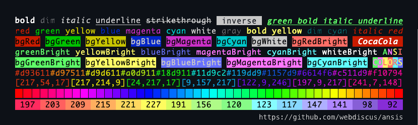

<div align="center">
  <h1>
    <a href="https://www.npmjs.com/package/ansis">
      <br>
      ANSI Styling
    </a>
  </h1>
  <div>The Node.js library for formatting text in terminal with ANSI colors & styles</div>
</div>

---
[](https://www.npmjs.com/package/ansis "download npm package")
[](https://codecov.io/gh/webdiscus/ansis)
[](https://www.npmjs.com/package/ansis)

The ansis use the SGR (Select Graphic Rendition) codes defined in
the [ECMA-48](https://www.ecma-international.org/publications-and-standards/standards/ecma-48/) standard.

> **Why yet one lib?**\
> Fastest, small, full [standard ANSI colors & styles](#base-colors), [truecolor](#truecolor), [chainable](#chained-syntax), [nestable](#nested-syntax), [template literals](#template-literals).\
> See [comparison of most popular ANSI colors libraries](https://github.com/webdiscus/ansis#compare-most-popular-ansi-libraries)
and [benchmark](https://github.com/webdiscus/ansis#benchmark).

<div align="center">
  <a href="https://www.npmjs.com/package/ansis">
    
  </a>
</div>


## Features

- supports both **ESM** and **CommonJS**
- up to **x3.5 faster** than **chalk**, [see benchmarks](#benchmark)
- unpacked dist code is **3 KB** only
- **standard API** compatible with many popular ANSI color libraries like **chalk**
- **named import** of styles & colors `import { red, blue, bold } from 'ansis/colors'`
- supports **chained** `red.bold('text')` syntax
- supports nested **template literals** ``` red`A ${cyan`B`} A` ```
- **ANSI 256** colors and Truecolor (**RGB**, **HEX**)
- supports **extending of base colors** with named custom truecolor
- auto detects color support
- supports the environment variables [`NO_COLOR`](https://no-color.org) `FORCE_COLOR` and flags `--no-color` `--color`
- supports removing ANSI color codes from string (**strip ANSI codes**)
- **TypeScript** friendly
- zero dependency


<a id="install" name="install" href="#install"></a>
## Install

```bash
npm install ansis
```


## Usage

```js
import { black, red, cyan, inverse } from 'ansis/colors'; // named import
import ansis from 'ansis'; // ESM
const ansis = require('ansis'); // CommonJS

console.log(ansis.green`Hello ${inverse`ANSI`} World!`);
console.log(black.bgYellow`Warning:` + cyan` /path/to/file.js ` + red`not found!`);
```

Output:\


## Named import

You can import named colors, styles and functions.
All imported colors and styles **are chainable**.

> **Note**
>
> Imported code is not treeshakeable.\
> Don't worry, full functional code is `3KB` only.

```js
import { red, green, blue, yellow, hex, bold, italic } from 'ansis/colors';

red.bold('text');
italic.underline.cyan('text');
hex('#FF75D1').bgCyan.bold('text');
```


<a id="chained-syntax" name="chained-syntax" href="#chained-syntax"></a>
## Chained syntax

```js
import ansis from 'ansis';
import { red, bold, underline } from 'ansis/colors';

// with namespace
ansis.red('text');
ansis.cyan.italic('text');
ansis.blau.underline.bold('text');

// with named import
red.italic.bold('text');
bold.italic.red('text');
underline.yellowBright('text');
```


<a id="nested-syntax" name="nested-syntax" href="#nested-syntax"></a>
## Nested syntax

```js
import { red, bold, italic, underline } from 'ansis/colors';

white(`MakBookPro, ${cyan(`RAM:`)} 64 GB`);
white(`MakBookPro, ${cyan(`RAM:`)} 64 GB | ${green(`GPU:`)} 32 cores`);
red(`${bold(`${italic(`${underline('underline')} italic`)} bold`)} red`);
```


<a id="templateLiterals" name="templateLiterals" href="#templateLiterals"></a>
## Template literals
**"Killer feature"**

Template literals allow to be complex template more readable and shortly.\
None of the existing libraries (chalk, kleur, colorette, colors.js etc.) support nested template strings.\
This does it only one library - `ansis`. Use it and enjoy!

```js
// import used standard styles, colors and functions
import { red, green, greenBright, cyan, cyanBright, bold, italic, hex } from 'ansis/colors';

// define custom colors
const pink = hex('#FF75D1');
const orange = hex('#FFAB40');

// template string
red`text`;
pink`text`;
orange`text`;

// chained
bold.cyan`text`;
italic.yellowBright`text`;
hex('#FF75D1').bgYellow.bold`text`;

// nested
white`MakBookPro, ${cyan`RAM:`} 64 GB`;
white`MakBookPro, ${cyan`RAM:`} 64 GB | ${green`GPU:`} 32 cores`;
white`MakBookPro, ${cyan`RAM: ${cyanBright`64`} GB`} | ${green`GPU: ${greenBright`32`} cores`}`;
red`${bold`${italic`${underline`underline`} italic`} bold`} red`;
```


## Extend base colors

Defaults, the imported `ansis` instance contains [base styles and colors](#base-colors).
To extends base colors with custom color names for truecolor use the `ansis.extend()` method.

```js
import ansis from 'ansis';

// extend base colors
ansis.extend({
  pink: '#FF75D1',
  orange: '#FFAB40',
});

// the custom colors are available under namespace `ansis`
ansis.pink('text');
ansis.orange('text');
```

Using in TypeScript:
```ts
import ansis, { AnsiColorsExtend } from 'ansis';

// extend base colors
ansis.extend({
  pink: '#FF75D1',
  orange: '#FFAB40',
});

const write = (style: AnsiColorsExtend<'pink' | 'orange'>, message: string) => {
  console.log(ansis[style](message));
}

write('red', 'message'); // base color OK
write('pink', 'message'); // extended color OK
write('orange', 'message'); // extended color OK
write('unknown', 'message'); // TypeScript Error
```


<a id="base-colors" name="base-colors" href="#base-colors"></a>
## Base styles and colors
### Styles

`reset`
`inverse`
`hidden`
`visible`
`bold`
`dim`(alias`faint`)
`italic`
`underline`
`doubleUnderline`
`overline`
`strikethrough`(alias `strike`)
`frame`
`encircle`

### Foreground colors

`black`
`red`
`green`
`blue`
`magenta`
`cyan`
`white`
`gray` (alias `grey`)
`blackBright`
`redBright`
`greenBright`
`yellowBright`
`blueBright`
`magentaBright`
`cyanBright`
`whiteBright`

### Background colors

`bgBlack`
`bgRed`
`bgGreen`
`bgYellow`
`bgBlue`
`bgMagenta`
`bgCyan`
`bgWhite`
`bgGray`
`bgBlackBright`
`bgRedBright`
`bgGreenBright`
`bgYellowBright`
`bgBlueBright`
`bgMagentaBright`
`bgCyanBright`
`bgWhiteBright`


## ANSI 256 colors

Foreground: `.ansi256(code)` has aliases `.ansi(code)` and `.fg(code)`\
Background: `.bgAnsi256(code)` has aliases `.bgAnsi(code)` and `.bg(code)`

The pre-defined set of 256 colors.

| Code range | Description                               |
|-----------:|-------------------------------------------|
|      0 - 7 | standard colors                           |
|     8 - 15 | bright colors                             |
|   16 - 231 | 6 × 6 × 6 cube (216 colors)               |
|  232 - 255 | grayscale from black to white in 24 steps |

See [ANSI color codes](https://en.wikipedia.org/wiki/ANSI_escape_code#8-bit).

```js
// foreground color
ansis.ansi256(96).bold('bold Bright Cyan');
ansis.fg(96).bold('bold Bright Cyan'); // `fg` is the short alias for `ansi256`

// background color
ansis.bgAnsi256(105)('Bright Magenta');
ansis.bg(105)('Bright Magenta'); // `bg` is the short alias for `bgAnsi256`
```

> The `ansi256()` and `bgAnsi256()` methods are implemented for compatibility with the `chalk` API.


<a id="truecolor" name="truecolor" href="#truecolor"></a>
## Truecolor

Foreground: `hex` `rgb`\
Background: `bgHex` `bgRgb`

```js
// foreground color
ansis.hex('#E0115F').bold('bold Ruby');
ansis.hex('#96C')('Amethyst');
ansis.rgb(224, 17, 95).italic.underline('italic underline Ruby');

// background color
ansis.bgHex('#E0115F')('Ruby');
ansis.bgHex('#96C')('Amethyst');
ansis.bgRgb(224, 17, 95)('Ruby');
```


## Shortcuts / Themes

Define your own themes:

```js
const theme = {
  error: ansis.red.bold,
  info: ansis.cyan.italic,
  warning: ansis.black.bgYellowBright,
  ruby: ansis.hex('#E0115F'),
};

theme.error('error');
theme.info('info');
theme.warning('warning');
theme.ruby('Ruby color');
```

## Low level usage

You can use the `open` and `close` properties for each style.

```js
const myStyle = ansis.bold.italic.black.bgHex('#ABCDEF');
console.log(`Hello ${myStyle.open}ANSI${myStyle.close} World!`);
```


## New lines

Supports correct style break at the `end of line`.

```js
ansis.bgGreen(`\nAnsis\nNew Line\nNext New Line\n`);
```


## Strip ANSI codes

The Ansis class contains one method `strip()` to remove all ANSI codes from string.

```js
import ansis from 'ansis';

const ansiString = ansis.green(`Hello ${ansis.inverse('ANSI')} World!`);
const string = ansis.strip(ansiString);
```

The variable `string` will contain the pure string `Hello ANSI World!`.


## CLI

Defaults, the output in terminal console is colored, and output in a file is uncolored.

### Environment variables
_example.js_
```js
import ansis from 'ansis';

console.log(ansis.red`COLOR`);
```

```
$ node example.js # => color output
$ node example.js > log.txt # => no color output
```

To force disable or enable colored output use environment variables `NO_COLOR` and `FORCE_COLOR`.

```
$ NO_COLOR=true node example.js # => force disable colors in output
$ FORCE_COLOR=true node example.js > log.txt # => force enable colors in output
```

### Arguments for executable script
If you have an executable script file.\
_example.js_
```js
#!/usr/bin/env node
import ansis from 'ansis';

console.log(ansis.red`COLOR`);
```

Use arguments `--no-color` or `--color=false` to disable colors and `--color` to enable ones.
```
$ ./example.js # => colors
$ ./example.js --no-color # => no colors
$ ./example.js --color=false # => no colors

$ ./example.js > log.txt # => no color
$ ./example.js --color > log.txt # => color
```


<a id="compare" href="#compare"></a>
## Comparison of most popular libraries

| Library                      |  Standard<br>style / color<br>naming   | Chained<br>styles | Nested<br>styles | New<br>Line | ANSI 256<br>colors<br>methods                                    | Truecolor<br>methods | Supports<br>NO_COLOR                               |
|------------------------------|:--------------------------------------:|:-----------------:|:----------------:|:-----------:|------------------------------------------------------------------|----------------------|:---------------------------------------------------|
| [`colors.js`][colors.js]     | no, e.g.<br>`brightRed`<br>(16 colors) |        yes        |       yes        |     yes     | -                                                                | -                    | only<br>`FORCE_COLOR`<br>`--no-color`<br>`--color` |
| [`colorette`][colorette]     |           yes<br>(16 colors)           |         -         |       yes        |      -      | -                                                                | -                    | yes                                                |
| [`picocolors`][picocolors]   |           yes<br>(8 colors)            |         -         |       yes        |      -      | -                                                                | -                    | yes                                                |
| [`cli-color`][cli-color]     |           yes<br>(16 colors)           |        yes        |       yes        |      -      | `.xterm(num)`                                                    | -                    | yes                                                |
| [`color-cli`][color-cli]     | no, e.g.<br>`red_bbt`<br>(16 colors)   |        yes        |     _buggy_      |     yes     | `.x<num>`                                                        | -                    | only<br>`--no-color`<br>`--color`                  |
| [`ansi-colors`][ansi-colors] |           yes<br>(16 colors)           |        yes        |       yes        |     yes     | -                                                                | -                    | only<br>`FORCE_COLOR`                              |
| [`kleur`][kleur]             |           yes<br>(8 colors)            |      _yes_*       |       yes        |      -      | -                                                                | -                    | yes                                                |
| [`chalk`][chalk]             |           yes<br>(16 colors)           |        yes        |       yes        |     yes     | `.ansi256(num)`<br>.`bgAnsi256(num)`                             | `.hex()` `.rgb()`    | yes                                                |
| [`ansis`][ansis-github]      |           yes<br>(16 colors)           |        yes        |       yes        |     yes     | `.ansi256(num)`<br>`.bgAnsi256(num)`<br>.`fg(num)`<br>.`bg(num)` | `.hex()` `.rgb()`    | yes                                                |

### Column description

- **Standard style and color naming**: `red` `redBright` `bgRed` `bgRedBright` etc., see above the **Foreground /
  Background colors**.
- **Chain styles**: `ansis.red.bold.underline('text')`.\
  `kleur` use the chain of functions: `kleur.red().bold().underline('text')`.
- **Nested styles**: correct closing of nested escape sequences.
  ```js
  c.red(`red ${c.green(`green ${c.underline(`underline`)} green`)} red`)
- **New Line**: correct break of escape sequences at `end of line`.
  ```js
  ansis.bgGreen(`\nAnsis\nNew Line\nNext New Line\n`);
  ```
- **NO_COLOR**: supports the environment variables [`NO_COLOR`](https://no-color.org) `FORCE_COLOR` and
  flags `--no-color` `--color`

## Show ANSI demo

```bash
git clone https://github.com/webdiscus/ansis.git
cd ./ansis
npm i
npm run demo
```

<a id="benchmark" href="#benchmark"></a>

## Benchmark

### Setup

```bash
git clone https://github.com/webdiscus/ansis.git
cd ./ansis/bench
npm i
```

### Run benchmark

```bash
npm run bench
```

> ### Tested on
>
> MacBook Pro 16" M1 Max 64GB\
> macOS Monterey 12.1\
> Node.js v16.13.1\
> Terminal `iTerm2`

### Colorette bench

The benchmark used in [`colorette`](https://github.com/jorgebucaran/colorette/blob/main/bench/index.js).

```js
c.red(`${c.bold(`${c.cyan(`${c.yellow('yellow')}cyan`)}`)}red`);
```

```diff
  colors.js           1,158,572 ops/sec
  colorette           4,572,582 ops/sec
  picocolors          3,841,124 ops/sec
  cli-color             470,320 ops/sec
  color-cli             109,811 ops/sec
  ansi-colors         1,265,615 ops/sec
  kleur/colors        2,281,415 ops/sec
  kleur               2,228,639 ops/sec
  chalk               2,287,146 ops/sec
+ ansis               2,669,734 ops/sec
```

### Base colors

```js
const colors = ['black', 'red', 'green', 'yellow', 'blue', 'magenta', 'cyan', 'white'];
colors.forEach((color) => c[color]('foo'));
```

```diff
  colors.js             640,101 ops/sec
  colorette           1,874,506 ops/sec
  picocolors          8,265,628 ops/sec
  cli-color             305,690 ops/sec
  color-cli             104,962 ops/sec
  ansi-colors         1,010,628 ops/sec
  kleur/colors        2,074,111 ops/sec
  kleur               5,455,121 ops/sec
  chalk               4,428,884 ops/sec
+ ansis               6,197,754 ops/sec
```

### Chained styles

```js
colors.forEach((color) => c[color].bold.underline.italic('foo'));
```

```diff
  colors.js             138,219 ops/sec
  colorette     (not supported)
  picocolors    (not supported)
  cli-color             144,837 ops/sec
  color-cli              52,732 ops/sec
  ansi-colors           158,921 ops/sec
  kleur/colors  (not supported)
  kleur                 514,035 ops/sec
  chalk               1,234,573 ops/sec
+ ansis               5,515,868 ops/sec

```

### Nested calls

```js
colors.forEach((color) => c[color](c.bold(c.underline(c.italic('foo')))));
```

```diff
  colors.js             166,425 ops/sec
  colorette             695,350 ops/sec
  picocolors            942,592 ops/sec
  cli-color              65,561 ops/sec
  color-cli              13,800 ops/sec
  ansi-colors           260,316 ops/sec
  kleur/colors          561,111 ops/sec
  kleur                 648,195 ops/sec
  chalk                 497,292 ops/sec
+ ansis                 558,575 ops/sec

```

### Nested styles

```js
c.red(`a red ${c.white('white')} red ${c.red('red')} red ${c.cyan('cyan')} red ${c.black('black')} red ${c.red(
  'red')} red ${c.green('green')} red ${c.red('red')} red ${c.yellow('yellow')} red ${c.blue('blue')} red ${c.red(
  'red')} red ${c.magenta('magenta')} red ${c.red('red')} red ${c.red('red')} red ${c.red('red')} red ${c.red(
  'red')} red ${c.red('red')} red ${c.red('red')} red ${c.red('red')} red ${c.red('red')} red ${c.red(
  'red')} red ${c.red('red')} red ${c.red('red')} red ${c.red('red')} red ${c.red('red')} red ${c.red(
  'red')} red ${c.red('red')} red ${c.green('green')} red ${c.red('red')} red ${c.red('red')} red ${c.red(
  'red')} red ${c.red('red')} red ${c.red('red')} red ${c.red('red')} red ${c.red('red')} red ${c.red(
  'red')} red ${c.red('red')} red ${c.red('red')} red ${c.magenta('magenta')} red ${c.red('red')} red ${c.red(
  'red')} red ${c.cyan('cyan')} red ${c.red('red')} red ${c.red('red')} red ${c.yellow('yellow')} red ${c.red(
  'red')} red ${c.red('red')} red ${c.red('red')} red ${c.red('red')} red ${c.red('red')} red ${c.red(
  'red')} red ${c.red('red')} message`);
```

```diff
  colors.js              89,633 ops/sec
  colorette             243,139 ops/sec
  picocolors            243,975 ops/sec
  cli-color              41,657 ops/sec
  color-cli              14,264 ops/sec
  ansi-colors           121,451 ops/sec
  kleur/colors          234,132 ops/sec
  kleur                 221,446 ops/sec
  chalk                 189,960 ops/sec
+ ansis                 211,868 ops/sec

```

### Deep nested styles

```js
c.green(
  `green ${c.cyan(
    `cyan ${c.red(
      `red ${c.yellow(
        `yellow ${c.blue(
          `blue ${c.magenta(
            `magenta ${c.underline(
              `underline ${c.italic(`italic`)} underline`
            )} magenta`
          )} blue`
        )} yellow`
      )} red`
    )} cyan`
  )} green`
);
```

```diff
  colors.js             451,592 ops/sec
  colorette           1,131,757 ops/sec
  picocolors          1,002,649 ops/sec
  cli-color             213,441 ops/sec
  color-cli              40,340 ops/sec
  ansi-colors           362,733 ops/sec
  kleur/colors          478,547 ops/sec
  kleur                 464,004 ops/sec
  chalk                 565,965 ops/sec
+ ansis                 882,220 ops/sec

```

### HEX colors

Only two libraries support truecolors methods: `ansis` and `chalk`

```js
c.hex('#FBA')('foo');
```

```diff
  colors.js             (not supported)
  colorette             (not supported)
  picocolors            (not supported)
  cli-color             (not supported)
  color-cli             (not supported)
  ansi-colors           (not supported)
  kleur/colors          (not supported)
  kleur                 (not supported)
  chalk               2,891,684 ops/sec
+ ansis               4,944,572 ops/sec
```

## Testing

`npm run test` will run the unit and integration tests.\
`npm run test:coverage` will run the tests with coverage.

## Also See

Most popular ANSI libraries for `Node.js`:

- [colors.js][colors.js]
- [colorette][colorette]
- [picocolors][picocolors]
- [cli-color][cli-color]
- [color-cli][color-cli]
- [ansi-colors][ansi-colors]
- [kleur][kleur]
- [chalk][chalk]

## License

[ISC](https://github.com/webdiscus/ansis/blob/master/LICENSE)

[colors.js]: https://github.com/Marak/colors.js
[colorette]: https://github.com/jorgebucaran/colorette
[picocolors]: https://github.com/alexeyraspopov/picocolors
[cli-color]: https://github.com/medikoo/cli-color
[color-cli]: https://github.com/jaywcjlove/colors-cli
[ansi-colors]: https://github.com/doowb/ansi-colors
[kleur]: https://github.com/lukeed/kleur
[chalk]: https://github.com/chalk/chalk
[ansis-github]: https://github.com/webdiscus/ansis
